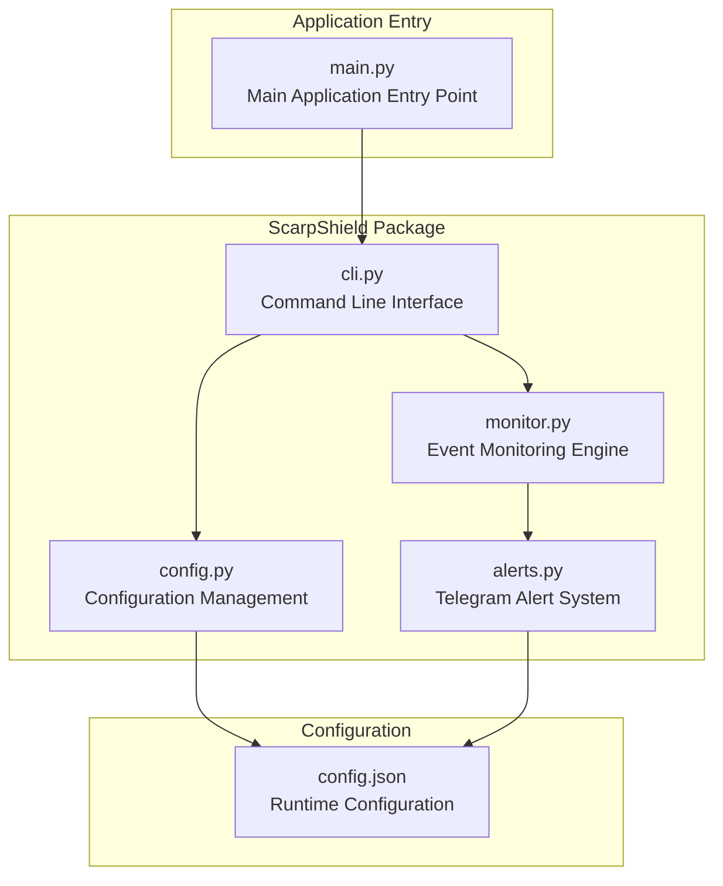
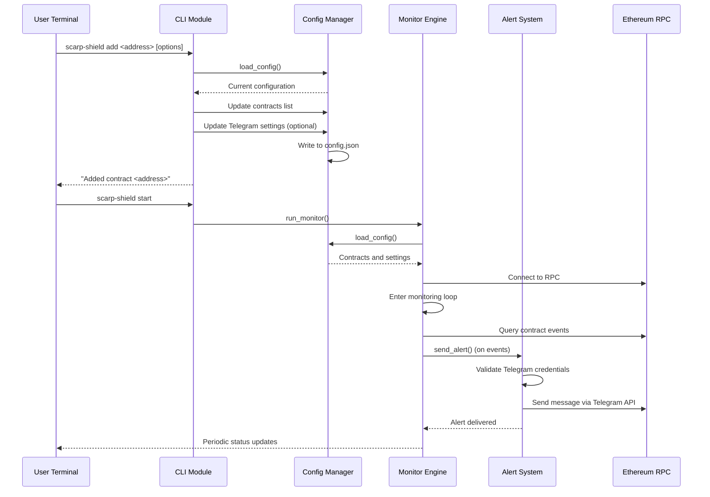
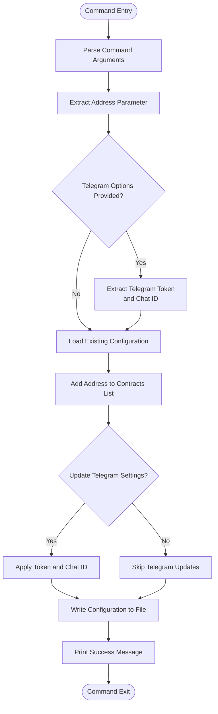
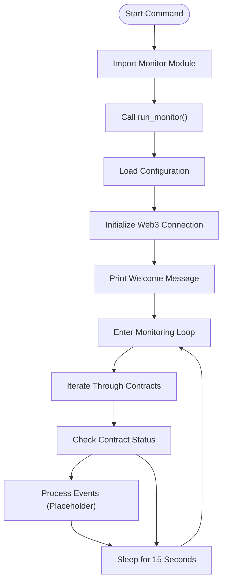
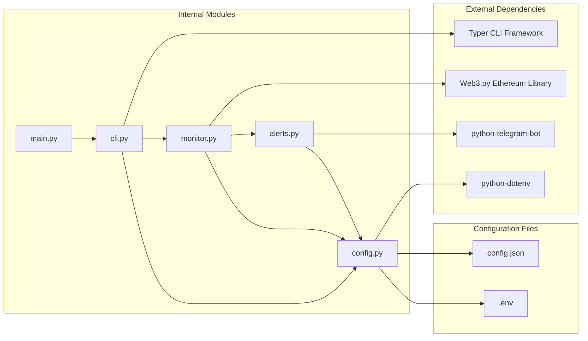

# CLI Command Reference

<cite>
**Referenced Files in This Document**
- [Build.txt](file://Build.txt)
</cite>

## Table of Contents
1. [Introduction](#introduction)
2. [Project Structure](#project-structure)
3. [Core Components](#core-components)
4. [Architecture Overview](#architecture-overview)
5. [Detailed Component Analysis](#detailed-component-analysis)
6. [Dependency Analysis](#dependency-analysis)
7. [Performance Considerations](#performance-considerations)
8. [Troubleshooting Guide](#troubleshooting-guide)
9. [Conclusion](#conclusion)

## Introduction
ScarpShield is a self-hosted CLI tool designed for monitoring smart contracts and sending Telegram alerts. The tool allows users to add contracts to monitor, configure Telegram notifications, and run a continuous monitoring engine that checks for contract events and sends real-time alerts.

The CLI provides two primary commands:
- `add`: Adds contracts to monitor and optionally configures Telegram notification settings
- `start`: Launches the monitoring engine to continuously check contracts for events

## Project Structure
The ScarpShield project follows a modular Python structure with clear separation of concerns:



**Diagram sources**
- [Build.txt:45-68](file://Build.txt#L45-L68)
- [Build.txt:34-44](file://Build.txt#L34-L44)
- [Build.txt:69-96](file://Build.txt#L69-L96)

**Section sources**
- [Build.txt:7-19](file://Build.txt#L7-L19)
- [Build.txt:45-68](file://Build.txt#L45-L68)

## Core Components

### CLI Module (cli.py)
The CLI module serves as the main entry point for command-line interactions, utilizing Typer for command definition and execution.

Key characteristics:
- Uses Typer framework for CLI command creation
- Implements two primary commands: `add` and `start`
- Integrates with configuration management system
- Provides user-friendly command-line interface

### Configuration Management (config.py)
Handles all configuration-related operations including loading, updating, and persisting application settings.

Primary functions:
- Loads configuration from JSON file
- Manages contract list updates
- Handles Telegram configuration settings
- Provides default configuration structure

### Monitoring Engine (monitor.py)
Core component responsible for contract event monitoring and periodic checking.

Features:
- Ethereum blockchain connectivity
- Contract event filtering
- Continuous monitoring loop
- Integration with alert system

### Alert System (alerts.py)
Manages Telegram notification delivery to configured chat recipients.

Capabilities:
- Asynchronous message sending
- Token-based authentication
- Chat ID routing
- Error handling for network issues

**Section sources**
- [Build.txt:45-68](file://Build.txt#L45-L68)
- [Build.txt:34-44](file://Build.txt#L34-L44)
- [Build.txt:69-96](file://Build.txt#L69-L96)

## Architecture Overview



**Diagram sources**
- [Build.txt:45-68](file://Build.txt#L45-L68)
- [Build.txt:69-96](file://Build.txt#L69-L96)

## Detailed Component Analysis

### Add Command Implementation

The `add` command provides contract management functionality with optional Telegram configuration capabilities.

#### Command Syntax and Parameters



**Diagram sources**
- [Build.txt:53-60](file://Build.txt#L53-L60)

#### Parameter Specifications

**Required Parameters:**
- `address` (string): Ethereum contract address to monitor
  - Format: Hexadecimal address starting with "0x"
  - Example: `0x742d35Cc6634C0532925a3b844Bc454e4438f44e`

**Optional Parameters:**
- `telegram_token` (string): Telegram bot token for notifications
  - Format: Bot token from @BotFather
  - Example: `123456789:AABBCCDDEEFF11223344556677889900AA`
- `chat_id` (string): Telegram chat identifier for alerts
  - Format: Numeric chat ID
  - Example: `123456789`

#### Usage Examples

Basic contract addition:
```bash
scarp-shield add 0x742d35Cc6634C0532925a3b844Bc454e4438f44e
```

Contract addition with Telegram configuration:
```bash
scarp-shield add 0x742d35Cc6634C0532925a3b844Bc454e4438f44e \
  --telegram-token 123456789:AABBCCDDEEFF11223344556677889900AA \
  --chat-id 123456789
```

#### Expected Output
- Success message: "Added contract <address>"
- Configuration file update: `config.json` with new contract entry
- Optional Telegram settings persistence if provided

**Section sources**
- [Build.txt:53-60](file://Build.txt#L53-L60)

### Start Command Implementation

The `start` command launches the monitoring engine that continuously checks configured contracts for events.

#### Command Execution Flow



**Diagram sources**
- [Build.txt:62-65](file://Build.txt#L62-L65)
- [Build.txt:76-84](file://Build.txt#L76-L84)

#### Runtime Behavior

**Monitoring Cycle:**
- Establishes connection to Ethereum RPC endpoint
- Iterates through all configured contracts
- Performs contract status checks
- Waits 15 seconds between cycles
- Continuously runs until interrupted

**Expected Output:**
- Initial welcome message: "ScarpShield monitoring started..."
- Periodic status updates: "Checked <contract_address>"
- Continuous operation until stopped with Ctrl+C

#### Error Handling and Return Values

**Error Scenarios:**
- Network connectivity issues with RPC endpoint
- Invalid contract addresses in configuration
- Telegram configuration errors during alert sending
- File system permissions for configuration updates

**Return Values:**
- Normal termination: Exit code 0
- Interrupt signal: Exit code 130 (Ctrl+C)
- Configuration errors: Exit code 1
- Network errors: Exit code 1

**Section sources**
- [Build.txt:62-65](file://Build.txt#L62-L65)
- [Build.txt:76-84](file://Build.txt#L76-L84)

## Dependency Analysis



**Diagram sources**
- [Build.txt:20-25](file://Build.txt#L20-L25)
- [Build.txt:45-68](file://Build.txt#L45-L68)
- [Build.txt:69-96](file://Build.txt#L69-L96)

**Section sources**
- [Build.txt:20-25](file://Build.txt#L20-L25)
- [Build.txt:45-68](file://Build.txt#L45-L68)

## Performance Considerations

### Monitoring Frequency
- Default polling interval: 15 seconds
- Configurable through monitoring engine modifications
- Balances responsiveness with network resource usage

### Network Optimization
- Single RPC connection maintained throughout execution
- Batch contract processing in each cycle
- Minimal network overhead per monitoring iteration

### Resource Management
- Memory usage remains constant during operation
- CPU usage minimal due to sleep intervals
- Network connections closed on process termination

## Troubleshooting Guide

### Common Issues and Solutions

**Configuration Loading Failures:**
- Verify `config.json` exists and is properly formatted
- Check file permissions for read/write access
- Ensure JSON syntax is valid

**Telegram Notification Issues:**
- Confirm bot token validity from @BotFather
- Verify chat ID belongs to the configured bot
- Check internet connectivity for Telegram API access

**Contract Monitoring Problems:**
- Validate contract addresses are on the correct network
- Ensure RPC endpoint accessibility
- Check contract ABI compatibility

**Command Execution Errors:**
- Verify Python 3.11+ installation
- Confirm all dependencies installed via requirements.txt
- Check Typer framework compatibility

### Debugging Commands

To verify configuration:
```bash
cat config.json
```

To test Telegram configuration:
```bash
python -c "from scarp_shield.alerts import send_alert; send_alert('Test message')"
```

**Section sources**
- [Build.txt:34-44](file://Build.txt#L34-L44)
- [Build.txt:85-92](file://Build.txt#L85-L92)

## Conclusion

ScarpShield provides a lightweight, self-hosted solution for monitoring smart contracts with integrated Telegram notifications. The CLI interface offers intuitive command-line interactions for contract management and monitoring operations.

Key benefits include:
- Complete self-hosting capability
- Real-time Telegram alerts
- Simple configuration management
- Extensible monitoring architecture
- Minimal resource requirements

The modular design allows for easy extension with additional contract event filters and monitoring capabilities while maintaining simplicity for basic use cases.