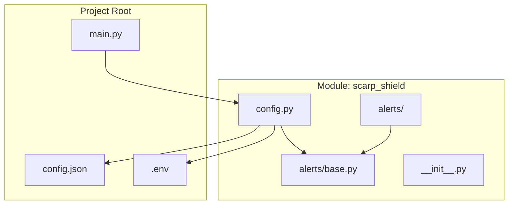
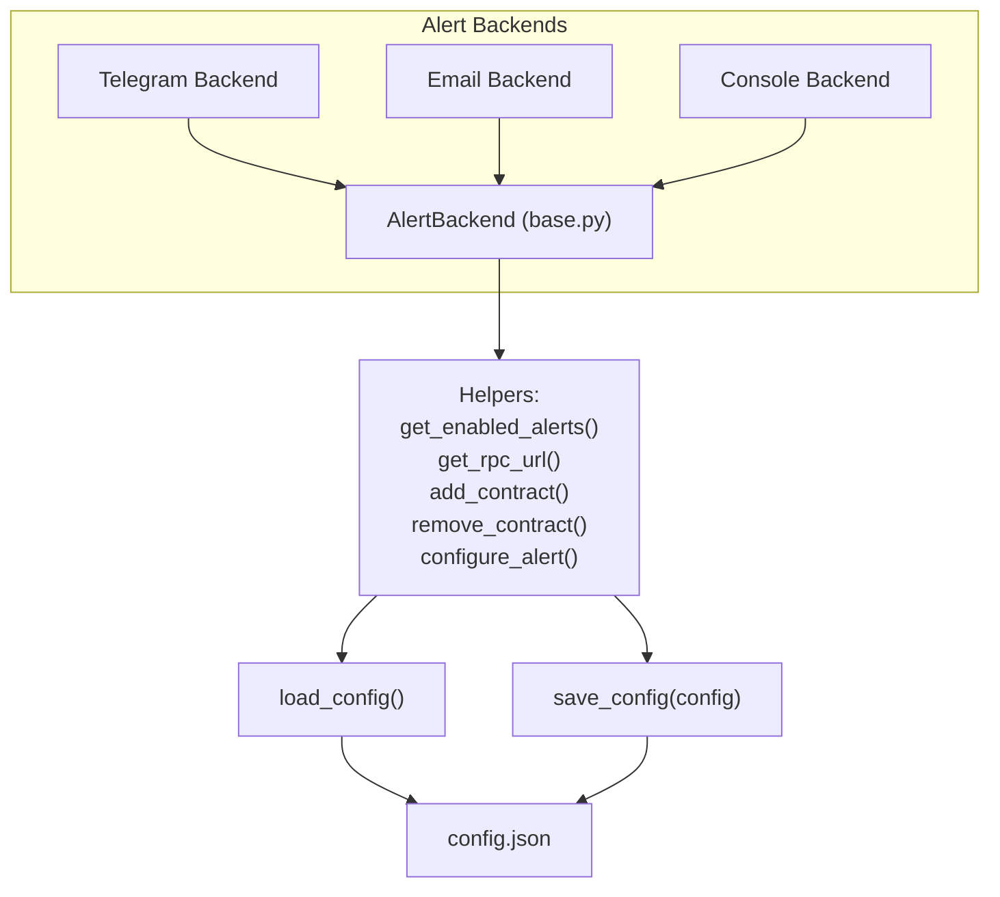
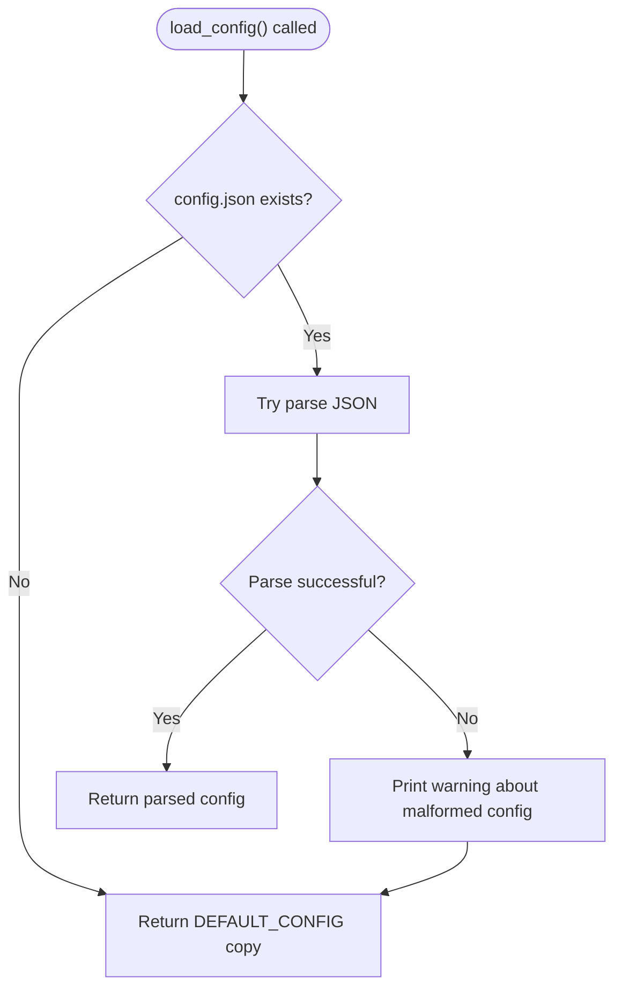
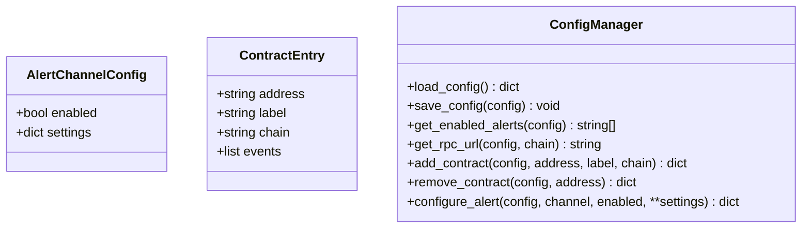
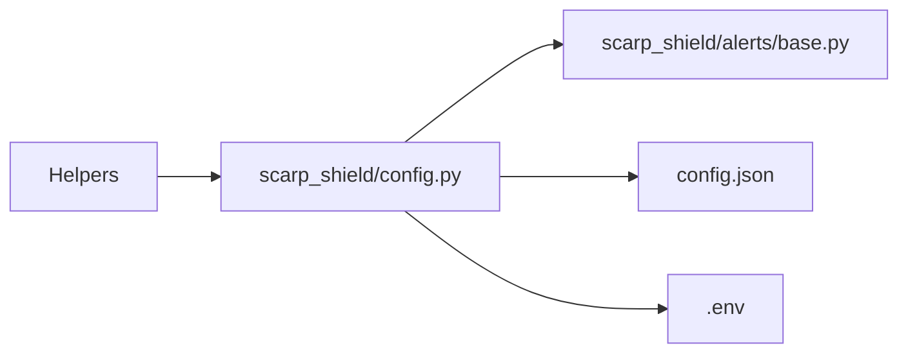

# Configuration Management

<cite>
**Referenced Files in This Document**
- [config.py](file://scarp_shield/config.py)
- [base.py](file://scarp_shield/alerts/base.py)
- [Build.txt](file://Build.txt)
</cite>

## Table of Contents
1. [Introduction](#introduction)
2. [Project Structure](#project-structure)
3. [Core Components](#core-components)
4. [Architecture Overview](#architecture-overview)
5. [Detailed Component Analysis](#detailed-component-analysis)
6. [Dependency Analysis](#dependency-analysis)
7. [Performance Considerations](#performance-considerations)
8. [Troubleshooting Guide](#troubleshooting-guide)
9. [Conclusion](#conclusion)
10. [Appendices](#appendices)

## Introduction
This document explains ScarpShield's configuration system with a focus on the config.json structure and management. It covers the JSON schema, configuration loading and persistence, environment variable integration, validation and defaults, and the relationship between global Telegram settings and per-contract configurations. It also provides guidance on updates, backups, and troubleshooting.

## Project Structure
ScarpShield organizes configuration logic in a dedicated module alongside alert backends. The configuration file is stored at the project root and loaded at runtime. Environment variables are supported via a dedicated environment file.

**Diagram sources**
- [config.py:8-11](file://scarp_shield/config.py#L8-L11)
- [Build.txt:39-44](file://Build.txt#L39-L44)

**Section sources**
- [config.py:8-11](file://scarp_shield/config.py#L8-L11)
- [Build.txt:39-44](file://Build.txt#L39-L44)

## Core Components
This section documents the configuration schema, defaults, and management functions.

- Configuration file location and environment file:
  - Configuration file: config.json located at the project root resolved relative to the module path.
  - Environment file: .env located at the project root for environment variable integration.

- Global branding fields:
  - project: string identifier for the project.
  - tool: string identifier for the tool.
  - version: semantic version string.

- Contracts array:
  - contracts: array of monitored contract entries.
  - Each contract entry includes:
    - address: string Ethereum-style address.
    - label: optional human-readable label.
    - chain: string chain identifier (default "ethereum").
    - events: array of event names to watch (default includes Transfer, OwnershipTransferred).

- RPC endpoints:
  - rpc_endpoints: map of chain identifiers to RPC endpoint URLs.
  - Defaults include ethereum, polygon, bsc, arbitrum, base.

- Poll interval:
  - poll_interval_seconds: integer seconds between polling cycles.

- Alerts configuration:
  - alerts: map of alert channels with enabled flag and settings.
  - Built-in channels include console, email, discord, slack, telegram.
  - Telegram settings include bot_token and chat_id.

- Filters:
  - filters: map of boolean flags controlling which events/types to watch:
    - min_transfer_value_eth: numeric threshold for large transfers.
    - watch_admin_events: boolean.
    - watch_large_transfers: boolean.
    - watch_approvals: boolean.

- Default configuration:
  - A comprehensive DEFAULT_CONFIG defines all keys and their default values.
  - When config.json is missing or malformed, the default configuration is returned.

- Configuration loading and persistence:
  - load_config(): reads config.json if present; otherwise returns defaults.
  - save_config(config): writes the current configuration to config.json.
  - Validation:
    - On JSON decode failure, defaults are loaded and a warning is printed.
  - Persistence pattern:
    - Config is saved after modifications (e.g., adding contracts or enabling alerts).

- Environment variable integration:
  - The environment file path is defined but no explicit loading is performed in the referenced code.
  - The build plan indicates environment variables for branding and website metadata.

- Helper functions:
  - get_enabled_alerts(config): returns enabled alert channel names.
  - get_rpc_url(config, chain): resolves RPC endpoint for a given chain.
  - add_contract(config, address, label, chain): appends a new contract entry if not duplicate.
  - remove_contract(config, address): removes a contract by address.
  - configure_alert(config, channel, enabled, **settings): toggles and updates channel settings.

**Section sources**
- [config.py:30-85](file://scarp_shield/config.py#L30-L85)
- [config.py:88-101](file://scarp_shield/config.py#L88-L101)
- [config.py:104-107](file://scarp_shield/config.py#L104-L107)
- [config.py:110-113](file://scarp_shield/config.py#L110-L113)
- [config.py:116-128](file://scarp_shield/config.py#L116-L128)
- [config.py:131-137](file://scarp_shield/config.py#L131-L137)
- [config.py:140-147](file://scarp_shield/config.py#L140-L147)
- [Build.txt:41-44](file://Build.txt#L41-L44)

## Architecture Overview
The configuration system centers on a single JSON file with helpers for loading, saving, and manipulating settings. Alert backends consume configuration to decide how and where to deliver notifications.

**Diagram sources**
- [config.py:88-101](file://scarp_shield/config.py#L88-L101)
- [config.py:104-147](file://scarp_shield/config.py#L104-L147)
- [base.py:8-35](file://scarp_shield/alerts/base.py#L8-L35)

## Detailed Component Analysis

### Configuration Schema and Defaults
- Top-level keys:
  - project, tool, version: branding identifiers.
  - contracts: array of contract entries.
  - rpc_endpoints: chain-to-RPC mapping.
  - poll_interval_seconds: polling cadence.
  - alerts: channel map with enabled flags and settings.
  - filters: boolean switches for event filtering.

- Default values:
  - All defaults are defined centrally and returned when config.json is absent or invalid.

- Example reference:
  - A minimal example is provided in the build plan for initial branding fields.

**Section sources**
- [config.py:30-85](file://scarp_shield/config.py#L30-L85)
- [Build.txt:130-136](file://Build.txt#L130-L136)

### Configuration Loading and Persistence
- Loading:
  - If config.json exists and is valid JSON, it is parsed.
  - On JSON decode errors, defaults are loaded and a warning is printed.
- Saving:
  - After any modification, the configuration is written back to config.json.

**Diagram sources**
- [config.py:88-96](file://scarp_shield/config.py#L88-L96)

**Section sources**
- [config.py:88-96](file://scarp_shield/config.py#L88-L96)
- [config.py:99-101](file://scarp_shield/config.py#L99-L101)

### Environment Variable Integration
- Environment file path is defined at the module level.
- No explicit loading of environment variables is performed in the referenced code.
- The build plan indicates environment variables for branding and website metadata.

**Section sources**
- [config.py:10-11](file://scarp_shield/config.py#L10-L11)
- [Build.txt:140-144](file://Build.txt#L140-L144)

### Alert Channel Configuration
- Channels:
  - console, email, discord, slack, telegram.
- Settings:
  - Each channel has an enabled flag and a settings dictionary.
  - Telegram settings include bot_token and chat_id.
- Helper:
  - configure_alert(channel, enabled, **settings) ensures the channel exists and updates its state.

**Diagram sources**
- [config.py:14-28](file://scarp_shield/config.py#L14-L28)
- [config.py:104-147](file://scarp_shield/config.py#L104-L147)

**Section sources**
- [config.py:14-28](file://scarp_shield/config.py#L14-L28)
- [config.py:140-147](file://scarp_shield/config.py#L140-L147)

### Relationship Between Global Telegram Settings and Per-Contract Configurations
- Global Telegram settings:
  - Located under alerts.telegram.settings with bot_token and chat_id.
- Per-contract configurations:
  - The contracts array contains address, label, chain, and events.
  - There is no per-contract Telegram override in the referenced code; alerts are sent via the globally configured Telegram settings.

**Section sources**
- [config.py:43-78](file://scarp_shield/config.py#L43-L78)
- [config.py:21-28](file://scarp_shield/config.py#L21-L28)

### Configuration Validation, Defaults, and Error Handling
- Validation:
  - JSON parsing is attempted; on failure, defaults are returned.
- Defaults:
  - Comprehensive DEFAULT_CONFIG centralizes all defaults.
- Error handling:
  - Malformed config triggers a warning and fallback to defaults.

**Section sources**
- [config.py:88-96](file://scarp_shield/config.py#L88-L96)
- [config.py:30-85](file://scarp_shield/config.py#L30-L85)

### Configuration Updates and Backup Strategies
- Updates:
  - Modify config.json directly or use helper functions to add/remove contracts and toggle channels.
  - Save changes using save_config().
- Backups:
  - Keep periodic copies of config.json.
  - Consider version control for non-sensitive configuration snapshots.

**Section sources**
- [config.py:99-101](file://scarp_shield/config.py#L99-L101)
- [config.py:116-137](file://scarp_shield/config.py#L116-L137)

## Dependency Analysis
Configuration depends on:
- File system for config.json and .env.
- Alert backends for consuming configuration.
- Helpers for managing contracts and channels.

**Diagram sources**
- [config.py:88-101](file://scarp_shield/config.py#L88-L101)
- [base.py:8-35](file://scarp_shield/alerts/base.py#L8-L35)

**Section sources**
- [config.py:88-101](file://scarp_shield/config.py#L88-L101)
- [base.py:8-35](file://scarp_shield/alerts/base.py#L8-L35)

## Performance Considerations
- File I/O:
  - Configuration is read on demand and written after changes; keep config.json small and avoid frequent writes.
- Polling:
  - poll_interval_seconds controls monitoring frequency; adjust based on network conditions and desired responsiveness.

## Troubleshooting Guide
- config.json is malformed:
  - Symptom: Warning printed and defaults loaded.
  - Action: Validate JSON syntax and restore a known-good backup.
- Missing config.json:
  - Symptom: Defaults applied on first run.
  - Action: Populate contracts and alert settings as needed.
- Telegram alerts not sending:
  - Verify alerts.telegram.enabled is true and bot_token/chat_id are set.
  - Ensure network connectivity and Telegram bot permissions.
- Contract not being monitored:
  - Confirm address is present in contracts array and not duplicated.
  - Check chain identifier matches intended network.

**Section sources**
- [config.py:88-96](file://scarp_shield/config.py#L88-L96)
- [config.py:116-128](file://scarp_shield/config.py#L116-L128)
- [config.py:140-147](file://scarp_shield/config.py#L140-L147)

## Conclusion
ScarpShield’s configuration model is straightforward: a single JSON file with robust defaults and helpers for safe loading, saving, and manipulation. Global Telegram settings control alert delivery, while contracts define monitoring targets. Follow the update and backup guidance to maintain a reliable configuration lifecycle.

## Appendices

### Example Configuration References
- Minimal branding example:
  - See the example provided in the build plan for initial project/tool fields.

**Section sources**
- [Build.txt:130-136](file://Build.txt#L130-L136)