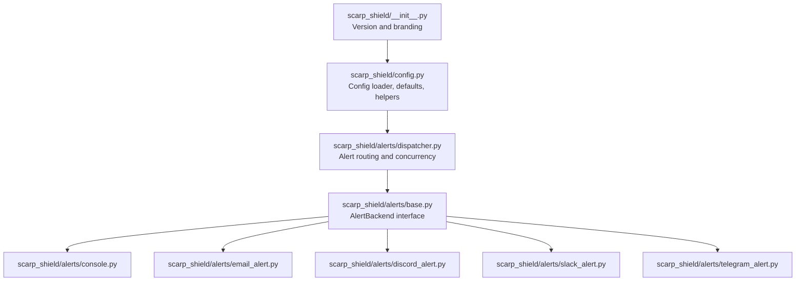
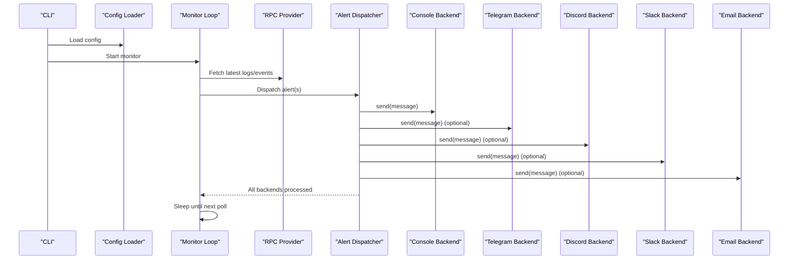
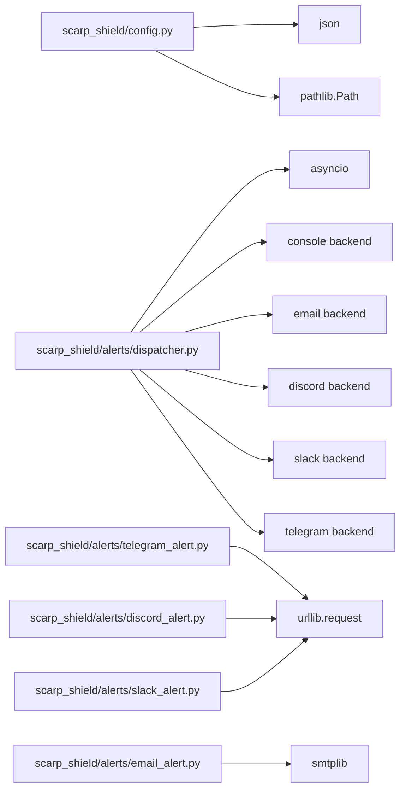

# Deployment and Maintenance

<cite>
**Referenced Files in This Document**
- [Build.txt](file://Build.txt)
- [scarp_shield/__init__.py](file://scarp_shield/__init__.py)
- [scarp_shield/config.py](file://scarp_shield/config.py)
- [scarp_shield/alerts/dispatcher.py](file://scarp_shield/alerts/dispatcher.py)
- [scarp_shield/alerts/base.py](file://scarp_shield/alerts/base.py)
- [scarp_shield/alerts/console.py](file://scarp_shield/alerts/console.py)
- [scarp_shield/alerts/email_alert.py](file://scarp_shield/alerts/email_alert.py)
- [scarp_shield/alerts/discord_alert.py](file://scarp_shield/alerts/discord_alert.py)
- [scarp_shield/alerts/slack_alert.py](file://scarp_shield/alerts/slack_alert.py)
- [scarp_shield/alerts/telegram_alert.py](file://scarp_shield/alerts/telegram_alert.py)
</cite>

## Table of Contents
1. [Introduction](#introduction)
2. [Project Structure](#project-structure)
3. [Core Components](#core-components)
4. [Architecture Overview](#architecture-overview)
5. [Detailed Component Analysis](#detailed-component-analysis)
6. [Dependency Analysis](#dependency-analysis)
7. [Performance Considerations](#performance-considerations)
8. [Troubleshooting Guide](#troubleshooting-guide)
9. [Conclusion](#conclusion)
10. [Appendices](#appendices)

## Introduction
This document provides comprehensive deployment and maintenance guidance for ScarpShield, a self-hosted CLI monitoring tool designed to watch selected smart contracts and send alerts via multiple channels. It focuses on running the tool on personal machines, managing configuration, monitoring health, optimizing performance, and ensuring secure, reliable long-term operation.

ScarpShield is a lightweight, private, local-first solution that runs on your machine and integrates with external services (Telegram, Discord, Slack, Email) for alert delivery. It supports multiple blockchains and exposes a simple CLI for adding contracts and starting the monitor loop.

## Project Structure
ScarpShield follows a modular layout centered around a CLI entrypoint, configuration management, and an alerting subsystem with pluggable backends.

**Diagram sources**
- [scarp_shield/__init__.py:1-6](file://scarp_shield/__init__.py#L1-L6)
- [scarp_shield/config.py:1-148](file://scarp_shield/config.py#L1-L148)
- [scarp_shield/alerts/dispatcher.py:1-62](file://scarp_shield/alerts/dispatcher.py#L1-L62)
- [scarp_shield/alerts/base.py:1-36](file://scarp_shield/alerts/base.py#L1-L36)
- [scarp_shield/alerts/console.py:1-12](file://scarp_shield/alerts/console.py#L1-L12)
- [scarp_shield/alerts/email_alert.py:1-43](file://scarp_shield/alerts/email_alert.py#L1-L43)
- [scarp_shield/alerts/discord_alert.py:1-36](file://scarp_shield/alerts/discord_alert.py#L1-L36)
- [scarp_shield/alerts/slack_alert.py:1-36](file://scarp_shield/alerts/slack_alert.py#L1-L36)
- [scarp_shield/alerts/telegram_alert.py:1-42](file://scarp_shield/alerts/telegram_alert.py#L1-L42)

**Section sources**
- [Build.txt:1-147](file://Build.txt#L1-L147)
- [scarp_shield/__init__.py:1-6](file://scarp_shield/__init__.py#L1-L6)

## Core Components
- Configuration module: Loads and persists configuration, merges defaults, and exposes helpers for contracts, RPC endpoints, and alert channels.
- Alert dispatcher: Dynamically instantiates enabled backends and dispatches alerts concurrently.
- Alert backends: Pluggable implementations for console, email, Discord, Slack, and Telegram.
- Version and branding: Centralized version and project metadata.

Key responsibilities:
- Config loading and persistence
- Contract watchlist management
- RPC endpoint selection per chain
- Polling loop and alert routing
- Backends’ safe sending with per-channel error handling

**Section sources**
- [scarp_shield/config.py:88-148](file://scarp_shield/config.py#L88-L148)
- [scarp_shield/alerts/dispatcher.py:21-62](file://scarp_shield/alerts/dispatcher.py#L21-L62)
- [scarp_shield/alerts/base.py:8-36](file://scarp_shield/alerts/base.py#L8-L36)
- [scarp_shield/__init__.py:4-6](file://scarp_shield/__init__.py#L4-L6)

## Architecture Overview
The runtime architecture centers on a polling loop that checks configured contracts at a fixed interval and routes detected events to enabled alert channels.

**Diagram sources**
- [scarp_shield/config.py:88-148](file://scarp_shield/config.py#L88-L148)
- [scarp_shield/alerts/dispatcher.py:21-62](file://scarp_shield/alerts/dispatcher.py#L21-L62)
- [scarp_shield/alerts/base.py:14-36](file://scarp_shield/alerts/base.py#L14-L36)
- [scarp_shield/alerts/telegram_alert.py:14-42](file://scarp_shield/alerts/telegram_alert.py#L14-L42)
- [scarp_shield/alerts/discord_alert.py:14-36](file://scarp_shield/alerts/discord_alert.py#L14-L36)
- [scarp_shield/alerts/slack_alert.py:14-36](file://scarp_shield/alerts/slack_alert.py#L14-L36)
- [scarp_shield/alerts/email_alert.py:14-43](file://scarp_shield/alerts/email_alert.py#L14-L43)
- [scarp_shield/alerts/console.py:10-12](file://scarp_shield/alerts/console.py#L10-L12)

## Detailed Component Analysis

### Configuration Management
- Defaults: Provides sensible defaults for contracts, RPC endpoints, polling interval, filters, and alert channels.
- Persistence: Reads/writes JSON configuration to a file resolved relative to the project root.
- Helpers: Adds/removes contracts, toggles alert channels, updates settings, and selects RPC endpoints by chain.
- Safety: On malformed JSON, falls back to defaults and continues.

Operational guidance:
- Keep a backup copy of the configuration file.
- Prefer enabling only the alert channels you need to reduce network overhead.
- Adjust poll intervals for cost and responsiveness trade-offs.

**Section sources**
- [scarp_shield/config.py:30-85](file://scarp_shield/config.py#L30-L85)
- [scarp_shield/config.py:88-148](file://scarp_shield/config.py#L88-L148)

### Alert Dispatcher and Backends
- Dispatcher: Builds a list of enabled backends and dispatches alerts concurrently. Includes a console backend as a guaranteed fallback when none are enabled.
- Backends: Implement a shared interface and include robustness against missing credentials or misconfiguration by printing warnings and continuing.

Backends:
- Console: Always enabled; prints formatted alerts to stdout.
- Telegram: Sends messages via Telegram Bot API.
- Discord: Posts to a webhook.
- Slack: Posts to a webhook.
- Email: Sends via SMTP with TLS.

**Section sources**
- [scarp_shield/alerts/dispatcher.py:21-62](file://scarp_shield/alerts/dispatcher.py#L21-L62)
- [scarp_shield/alerts/base.py:8-36](file://scarp_shield/alerts/base.py#L8-L36)
- [scarp_shield/alerts/console.py:7-12](file://scarp_shield/alerts/console.py#L7-L12)
- [scarp_shield/alerts/telegram_alert.py:11-42](file://scarp_shield/alerts/telegram_alert.py#L11-L42)
- [scarp_shield/alerts/discord_alert.py:11-36](file://scarp_shield/alerts/discord_alert.py#L11-L36)
- [scarp_shield/alerts/slack_alert.py:11-36](file://scarp_shield/alerts/slack_alert.py#L11-L36)
- [scarp_shield/alerts/email_alert.py:11-43](file://scarp_shield/alerts/email_alert.py#L11-L43)

### Monitoring Loop and Event Detection
- Polling: Periodic checks of configured contracts at a configurable interval.
- RPC Selection: Chooses endpoints per chain from configuration.
- Alerts: Dispatches formatted alerts to enabled channels.

Operational guidance:
- Start with conservative poll intervals to avoid rate limits.
- Add specific event filters as needed to reduce noise.
- Monitor backend failures and adjust channel configurations accordingly.

**Section sources**
- [Build.txt:69-84](file://Build.txt#L69-L84)
- [scarp_shield/config.py:110-114](file://scarp_shield/config.py#L110-L114)

## Dependency Analysis
ScarpShield’s dependencies are minimal and focused on core functionality:
- web3: Ethereum RPC connectivity
- python-telegram-bot: Optional Telegram integration
- python-dotenv: Environment variable support
- typer: CLI framework

**Diagram sources**
- [scarp_shield/config.py:4-11](file://scarp_shield/config.py#L4-L11)
- [scarp_shield/alerts/dispatcher.py:4-18](file://scarp_shield/alerts/dispatcher.py#L4-L18)
- [scarp_shield/alerts/telegram_alert.py:5-6](file://scarp_shield/alerts/telegram_alert.py#L5-L6)
- [scarp_shield/alerts/email_alert.py:4-6](file://scarp_shield/alerts/email_alert.py#L4-L6)
- [scarp_shield/alerts/discord_alert.py:5-6](file://scarp_shield/alerts/discord_alert.py#L5-L6)
- [scarp_shield/alerts/slack_alert.py:5-6](file://scarp_shield/alerts/slack_alert.py#L5-L6)

**Section sources**
- [Build.txt:20-26](file://Build.txt#L20-L26)

## Performance Considerations
- Polling interval: Tune the poll interval to balance responsiveness and RPC costs. Lower intervals increase network usage and potential rate limiting.
- Concurrency: Alerts are dispatched concurrently; excessive enabled channels can increase CPU and network load.
- Event filtering: Narrow down watched events and apply filters (e.g., minimum transfer thresholds) to reduce alert volume.
- RPC endpoints: Choose reliable endpoints per chain; consider paid tiers for higher throughput and reliability.
- Resource usage: On personal machines, monitor CPU and memory during extended runs. Reduce enabled channels and simplify filters if needed.

[No sources needed since this section provides general guidance]

## Troubleshooting Guide
Common operational issues and recovery procedures:
- Malformed configuration file:
  - Symptom: Startup warnings and fallback to defaults.
  - Action: Validate JSON syntax and correct errors; restart after fixing.
- Missing Telegram credentials:
  - Symptom: Warning printed and alert skipped.
  - Action: Set bot token and chat ID; enable Telegram channel.
- Missing Discord/Slack webhook URLs:
  - Symptom: Warning printed and alert skipped.
  - Action: Configure webhook URLs in settings; enable the channel.
- Email misconfiguration:
  - Symptom: Warning printed and alert skipped.
  - Action: Verify SMTP host/port/user/password; ensure TLS is supported.
- Rate limiting or RPC errors:
  - Symptom: Delays or intermittent failures.
  - Action: Increase poll interval; switch to a different RPC endpoint; consider paid providers.
- No alerts delivered:
  - Symptom: Expected alerts not received.
  - Action: Ensure at least one alert channel is enabled; verify console output; check backend-specific credentials and permissions.

**Section sources**
- [scarp_shield/config.py:93-96](file://scarp_shield/config.py#L93-L96)
- [scarp_shield/alerts/dispatcher.py:50-58](file://scarp_shield/alerts/dispatcher.py#L50-L58)
- [scarp_shield/alerts/telegram_alert.py:17-19](file://scarp_shield/alerts/telegram_alert.py#L17-L19)
- [scarp_shield/alerts/discord_alert.py:16-18](file://scarp_shield/alerts/discord_alert.py#L16-L18)
- [scarp_shield/alerts/slack_alert.py:16-18](file://scarp_shield/alerts/slack_alert.py#L16-L18)
- [scarp_shield/alerts/email_alert.py:22-24](file://scarp_shield/alerts/email_alert.py#L22-L24)

## Conclusion
ScarpShield offers a straightforward, self-hosted monitoring solution suitable for personal machines and small-scale operations. By carefully managing configuration, selecting appropriate RPC endpoints, tuning polling intervals, and enabling only necessary alert channels, you can achieve reliable, low-cost monitoring with strong privacy guarantees. Regular maintenance, log review, and periodic updates will keep the system healthy and responsive over the long term.

[No sources needed since this section summarizes without analyzing specific files]

## Appendices

### A. Deployment Checklist (Self-Hosted)
- Install Python 3.11+ and dependencies.
- Create and populate configuration with contracts, RPC endpoints, and desired alert channels.
- Enable at least one alert channel; configure credentials/webhooks.
- Start the monitor and verify console output.
- Optionally run as a background service or scheduled task.

**Section sources**
- [Build.txt:4-5](file://Build.txt#L4-L5)
- [Build.txt:30](file://Build.txt#L30)
- [scarp_shield/config.py:30-85](file://scarp_shield/config.py#L30-L85)

### B. Maintenance Procedures
- Update process:
  - Pull latest code and reinstall dependencies.
  - Review breaking changes in configuration defaults or RPC endpoints.
  - Restart the monitor to apply updates.
- Configuration management:
  - Keep backups of config.json.
  - Use additive changes (add contracts, enable channels) rather than destructive edits.
  - Validate JSON syntax before restarting.
- Log management:
  - Console output serves as the primary log; redirect stdout to a file if running as a service.
  - Monitor backend error messages for transient failures.

**Section sources**
- [scarp_shield/config.py:99-101](file://scarp_shield/config.py#L99-L101)
- [scarp_shield/alerts/dispatcher.py:50-58](file://scarp_shield/alerts/dispatcher.py#L50-L58)

### C. Security Considerations
- Keep credentials secret:
  - Store tokens and passwords in environment variables or secure secret stores; avoid committing secrets to version control.
- Limit exposure:
  - Run on trusted machines; restrict access to the process and configuration files.
- Network hygiene:
  - Prefer HTTPS endpoints; rotate RPC endpoints periodically.
- Least privilege:
  - Enable only required alert channels to minimize attack surface.

[No sources needed since this section provides general guidance]

### D. Best Practices for Long-Term Operation
- Monitor health:
  - Watch console output and backend error logs.
  - Set up external watchdogs if running unattended.
- Optimize performance:
  - Increase poll intervals under light load; reduce under heavy load.
  - Apply filters to reduce false positives.
- Reliability:
  - Use redundant RPC endpoints.
  - Back up configuration regularly.
- Upgrades:
  - Test updates in a staging environment before applying to production.

[No sources needed since this section provides general guidance]