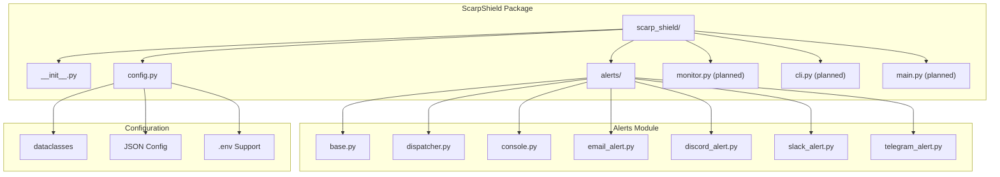
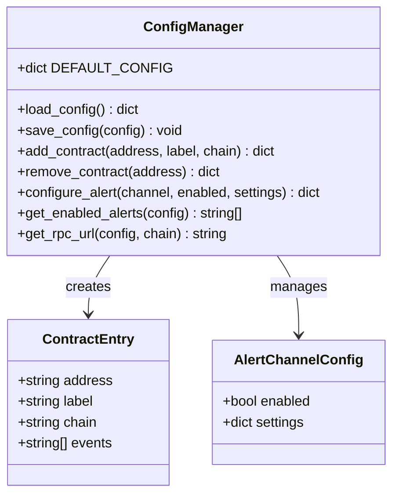
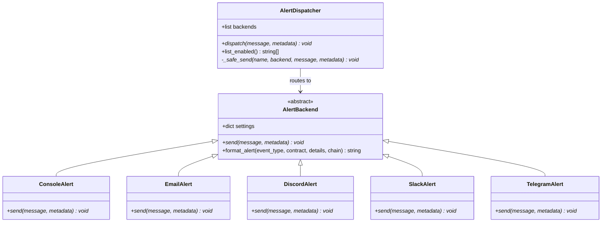
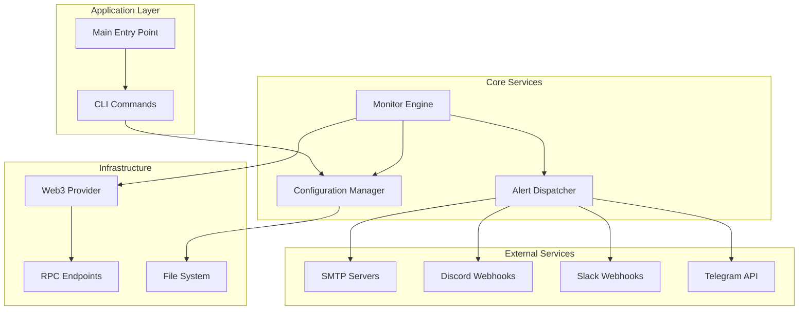
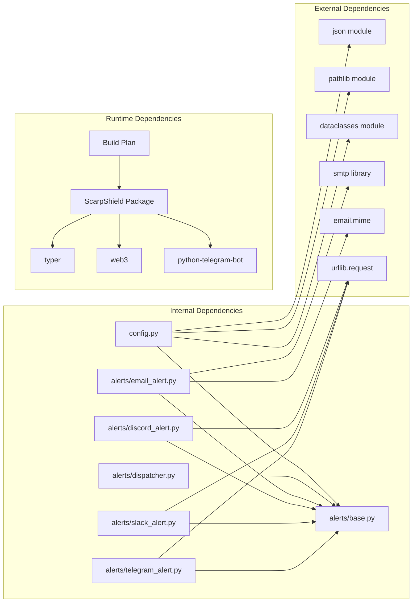

# Development Implementation Guide

<cite>
**Referenced Files in This Document**
- [Build.txt](file://Build.txt)
- [scarp_shield/__init__.py](file://scarp_shield/__init__.py)
- [scarp_shield/config.py](file://scarp_shield/config.py)
- [scarp_shield/alerts/base.py](file://scarp_shield/alerts/base.py)
- [scarp_shield/alerts/dispatcher.py](file://scarp_shield/alerts/dispatcher.py)
- [scarp_shield/alerts/console.py](file://scarp_shield/alerts/console.py)
- [scarp_shield/alerts/email_alert.py](file://scarp_shield/alerts/email_alert.py)
- [scarp_shield/alerts/discord_alert.py](file://scarp_shield/alerts/discord_alert.py)
- [scarp_shield/alerts/slack_alert.py](file://scarp_shield/alerts/slack_alert.py)
- [scarp_shield/alerts/telegram_alert.py](file://scarp_shield/alerts/telegram_alert.py)
</cite>

## Table of Contents
1. [Introduction](#introduction)
2. [Project Structure](#project-structure)
3. [Core Components](#core-components)
4. [Architecture Overview](#architecture-overview)
5. [Detailed Component Analysis](#detailed-component-analysis)
6. [Dependency Analysis](#dependency-analysis)
7. [Performance Considerations](#performance-considerations)
8. [Testing Strategies](#testing-strategies)
9. [Debugging Techniques](#debugging-techniques)
10. [Development Workflow](#development-workflow)
11. [Code Organization Principles](#code-organization-principles)
12. [Extending Functionality](#extending-functionality)
13. [Common Development Tasks](#common-development-tasks)
14. [Troubleshooting Guide](#troubleshooting-guide)
15. [Conclusion](#conclusion)

## Introduction

ScarpShield is a self-hosted CLI monitoring tool designed to track smart contract events and send real-time alerts via multiple channels. Built with Python 3.11+, this lightweight application runs locally on users' machines, providing privacy-focused monitoring capabilities for blockchain contracts.

The tool integrates with CounterScarp.io ecosystem while maintaining complete independence. It supports multiple blockchain networks, configurable alert channels, and extensible event filtering mechanisms.

## Project Structure

The ScarpShield project follows a modular Python package structure optimized for maintainability and extensibility:

**Diagram sources**
- [scarp_shield/__init__.py:1-6](file://scarp_shield/__init__.py#L1-L6)
- [scarp_shield/config.py:1-148](file://scarp_shield/config.py#L1-L148)
- [scarp_shield/alerts/base.py:1-36](file://scarp_shield/alerts/base.py#L1-L36)

**Section sources**
- [Build.txt:7-19](file://Build.txt#L7-L19)
- [scarp_shield/__init__.py:1-6](file://scarp_shield/__init__.py#L1-L6)

## Core Components

### Configuration Management System

The configuration system provides centralized management of all application settings with robust defaults and validation:

**Diagram sources**
- [scarp_shield/config.py:14-148](file://scarp_shield/config.py#L14-L148)

### Alert Distribution Framework

The alert system implements a flexible dispatcher pattern supporting multiple notification channels:

**Diagram sources**
- [scarp_shield/alerts/base.py:8-36](file://scarp_shield/alerts/base.py#L8-L36)
- [scarp_shield/alerts/dispatcher.py:21-62](file://scarp_shield/alerts/dispatcher.py#L21-L62)
- [scarp_shield/alerts/console.py:7-12](file://scarp_shield/alerts/console.py#L7-L12)

**Section sources**
- [scarp_shield/config.py:88-148](file://scarp_shield/config.py#L88-L148)
- [scarp_shield/alerts/dispatcher.py:21-62](file://scarp_shield/alerts/dispatcher.py#L21-L62)

## Architecture Overview

ScarpShield implements a layered architecture with clear separation of concerns:

**Diagram sources**
- [scarp_shield/config.py:88-148](file://scarp_shield/config.py#L88-L148)
- [scarp_shield/alerts/dispatcher.py:21-62](file://scarp_shield/alerts/dispatcher.py#L21-L62)

## Detailed Component Analysis

### Configuration Management

The configuration system provides comprehensive settings management with support for multiple blockchain networks and alert channels:

**Key Features:**
- Centralized configuration storage in JSON format
- Environment variable integration via `.env` files
- Multi-chain RPC endpoint configuration
- Flexible alert channel enablement
- Contract watchlist management

**Configuration Structure:**
- Project metadata (name, tool, version)
- Contract monitoring entries with chain-specific settings
- RPC endpoint configurations for multiple networks
- Alert channel settings with individual configurations
- Event filtering parameters

**Section sources**
- [scarp_shield/config.py:30-85](file://scarp_shield/config.py#L30-L85)
- [scarp_shield/config.py:88-148](file://scarp_shield/config.py#L88-L148)

### Alert Backend Implementations

Each alert backend implements the standardized interface while handling specific service requirements:

**Console Alerts:**
- Immediate output to standard console
- Always enabled as fallback mechanism
- Simple text formatting with timestamp

**Email Alerts:**
- SMTP protocol support with TLS encryption
- Configurable SMTP server settings
- Multiple recipient support
- Plain text message formatting

**Discord Alerts:**
- Webhook-based message delivery
- Code block formatting for structured messages
- Custom username configuration

**Slack Alerts:**
- Webhook integration with formatted text
- Code block presentation
- Username customization

**Telegram Alerts:**
- HTTP API integration
- HTML parsing mode support
- Bot token and chat ID authentication

**Section sources**
- [scarp_shield/alerts/console.py:7-12](file://scarp_shield/alerts/console.py#L7-L12)
- [scarp_shield/alerts/email_alert.py:11-43](file://scarp_shield/alerts/email_alert.py#L11-L43)
- [scarp_shield/alerts/discord_alert.py:11-36](file://scarp_shield/alerts/discord_alert.py#L11-L36)
- [scarp_shield/alerts/slack_alert.py:11-36](file://scarp_shield/alerts/slack_alert.py#L11-L36)
- [scarp_shield/alerts/telegram_alert.py:11-42](file://scarp_shield/alerts/telegram_alert.py#L11-L42)

## Dependency Analysis

The project maintains clean dependency boundaries with minimal external coupling:

**Diagram sources**
- [scarp_shield/config.py:4-12](file://scarp_shield/config.py#L4-L12)
- [scarp_shield/alerts/base.py:4-6](file://scarp_shield/alerts/base.py#L4-L6)

**Section sources**
- [Build.txt:20-26](file://Build.txt#L20-L26)
- [scarp_shield/config.py:4-12](file://scarp_shield/config.py#L4-L12)

## Performance Considerations

### Monitoring Efficiency
- Configurable polling intervals to balance responsiveness and resource usage
- Asynchronous alert dispatching to prevent blocking operations
- Efficient contract iteration with duplicate prevention
- Network timeout management for RPC connections

### Memory Management
- Lazy loading of alert backends based on configuration
- Minimal in-memory state during monitoring cycles
- Proper resource cleanup for network connections
- Config caching to avoid repeated file I/O

### Scalability Factors
- Modular architecture allows selective feature enabling
- Pluggable alert backend system supports future extensions
- Chain-agnostic design enables multi-network support
- Event filtering reduces unnecessary processing

## Testing Strategies

### Unit Testing Approach
- Isolate configuration loading and validation logic
- Mock external services for alert backends
- Test event filtering logic independently
- Validate configuration serialization/deserialization

### Integration Testing
- End-to-end monitoring cycle testing
- Real RPC endpoint connectivity verification
- Alert delivery validation across channels
- Configuration persistence testing

### Mock-Based Testing
- Web3 provider mocking for event simulation
- Alert backend stubs for delivery verification
- File system mocking for config operations
- Network error simulation for resilience testing

### Test Data Management
- Sample contract addresses for testing
- Valid and invalid configuration examples
- Edge case scenarios for boundary conditions
- Multi-chain test configurations

## Debugging Techniques

### Logging Strategy
- Structured logging for alert delivery failures
- Configuration validation error reporting
- RPC connection status monitoring
- Event processing diagnostics

### Error Handling Patterns
- Graceful degradation when external services fail
- Config file corruption recovery with defaults
- Network timeout handling with retry logic
- Type validation for configuration parameters

### Development Tools
- Interactive configuration testing
- Alert channel isolation for troubleshooting
- Network connectivity verification
- Event simulation for testing

### Common Debug Scenarios
- Configuration file permission issues
- Network connectivity problems
- Alert backend authentication failures
- Contract address validation errors

## Development Workflow

### Iterative Development Approach
1. **Foundation Phase**: Establish configuration and alert systems
2. **Core Functionality**: Implement monitoring engine and event filtering
3. **Integration Phase**: Connect to blockchain networks and external services
4. **Testing Phase**: Comprehensive testing with mock environments
5. **Production Readiness**: Performance optimization and error handling

### Code Organization Principles
- Single responsibility for each module
- Clear interface contracts between components
- Consistent error handling patterns
- Comprehensive documentation for public APIs
- Configurable behavior through settings

### Version Control Strategy
- Feature branches for major components
- Regular commits with descriptive messages
- Pull request reviews for significant changes
- Semantic versioning for releases

## Code Organization Principles

### Module Design
- Each alert type in separate dedicated modules
- Base classes for shared functionality
- Clear import/export boundaries
- Consistent naming conventions

### Data Flow Patterns
- Configuration-driven behavior
- Event-driven alert processing
- Asynchronous operation handling
- Error propagation with context

### Extension Points
- Plugin-like alert backend system
- Configurable event filtering
- Multi-chain network support
- Customizable alert formatting

## Extending Functionality

### Adding New Alert Channels
1. Create new backend class inheriting from AlertBackend
2. Implement async send method with service-specific logic
3. Register backend in dispatcher configuration
4. Add configuration schema validation
5. Test integration with alert system

### Event Filtering Enhancement
- Implement specialized event processors
- Add parameterized filtering rules
- Support for complex event condition matching
- Performance optimization for large event sets

### Blockchain Network Support
- Extend RPC endpoint configuration
- Add network-specific transaction processing
- Implement chain-specific event decoding
- Support for custom network configurations

## Common Development Tasks

### Configuration Management
- Adding new configuration parameters
- Implementing configuration validation
- Supporting environment-specific overrides
- Managing configuration migrations

### Alert Channel Development
- Creating new notification integrations
- Implementing rate limiting and throttling
- Adding message templating systems
- Supporting rich media content

### Monitoring Engine Enhancement
- Optimizing event polling efficiency
- Implementing batch processing
- Adding smart contract ABI management
- Supporting WebSocket-based real-time updates

### User Interface Extensions
- CLI command enhancement
- Configuration file generation
- Status reporting mechanisms
- Interactive setup wizards

## Troubleshooting Guide

### Configuration Issues
**Problem**: Configuration file not found or unreadable
**Solution**: Verify file permissions and existence, check JSON syntax validity

**Problem**: RPC endpoint connectivity failures
**Solution**: Test network connectivity, verify endpoint URLs, check rate limits

**Problem**: Alert delivery failures
**Solution**: Validate service credentials, check network connectivity, review error logs

### Performance Problems
**Problem**: High CPU usage during monitoring
**Solution**: Increase polling intervals, optimize event filtering, implement caching

**Problem**: Memory leaks or growth
**Solution**: Review object lifecycle management, implement proper cleanup, monitor memory usage

### Integration Challenges
**Problem**: Alert backend authentication failures
**Solution**: Verify API keys and tokens, check service availability, implement retry logic

**Problem**: Event processing inconsistencies
**Solution**: Add comprehensive logging, implement deduplication mechanisms, validate event signatures

**Section sources**
- [scarp_shield/config.py:88-96](file://scarp_shield/config.py#L88-L96)
- [scarp_shield/alerts/dispatcher.py:50-58](file://scarp_shield/alerts/dispatcher.py#L50-L58)

## Conclusion

ScarpShield provides a robust foundation for blockchain contract monitoring with a focus on modularity, extensibility, and user control. The implementation demonstrates clean architectural principles with clear separation of concerns and comprehensive error handling.

The modular design enables easy extension with new alert channels, event types, and blockchain networks. The configuration-driven approach ensures flexibility while maintaining simplicity for end users.

Key strengths include:
- Privacy-focused local operation
- Multi-channel alert distribution
- Configurable event filtering
- Extensible architecture for future enhancements
- Comprehensive error handling and logging

Future development should focus on performance optimization, additional blockchain network support, and enhanced user experience features while maintaining the core principles of simplicity and reliability.