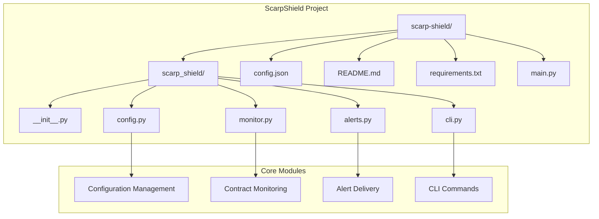
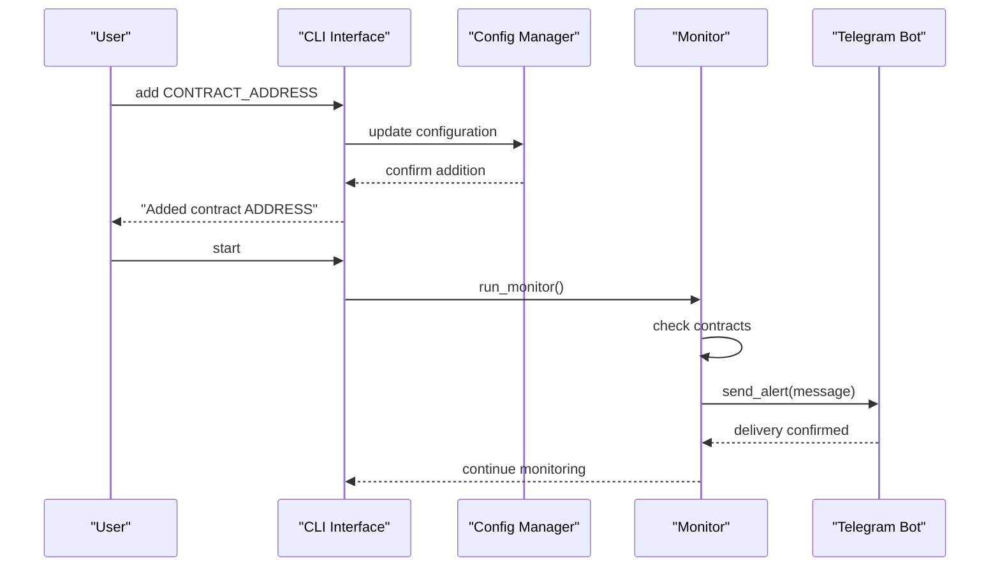

# Getting Started

<cite>
**Referenced Files in This Document**
- [Build.txt](file://Build.txt)
</cite>

## Table of Contents
1. [Introduction](#introduction)
2. [Prerequisites](#prerequisites)
3. [Installation](#installation)
4. [Project Structure](#project-structure)
5. [Basic Workflow](#basic-workflow)
6. [Telegram Bot Setup](#telegram-bot-setup)
7. [Configuration Files](#configuration-files)
8. [First-Time User Experience](#first-time-user-experience)
9. [Common Setup Scenarios](#common-setup-scenarios)
10. [Troubleshooting Guide](#troubleshooting-guide)
11. [Verification Steps](#verification-steps)
12. [Next Steps](#next-steps)

## Introduction
ScarpShield is a self-hosted CLI tool designed to monitor Ethereum smart contracts and send real-time Telegram alerts. It runs locally on your machine, giving you complete control over your monitoring setup. The tool allows you to add specific contracts you want to track, configure Telegram notifications, and monitor events in real-time.

Key capabilities:
- Monitor specific smart contracts you care about
- Receive Telegram alerts for important contract events
- Run entirely on your local machine
- Lightweight and private deployment
- Event filtering for meaningful alerts

## Prerequisites
Before installing ScarpShield, ensure you have the following prerequisites:

### Python Environment
- Python 3.11 or higher is required for optimal compatibility
- A clean virtual environment is recommended for isolation
- Pip package manager for dependency installation

### Development Tools
- Basic text editor or IDE (VS Code, PyCharm, etc.)
- Command-line interface for running the tool
- Git for version control (optional but recommended)

### Network Access
- Internet connection for downloading dependencies
- Access to Ethereum RPC endpoints (default configured)
- Telegram account for receiving alerts

**Section sources**
- [Build.txt:4](file://Build.txt#L4)

## Installation
Follow these step-by-step installation instructions to set up ScarpShield:

### Step 1: Create Project Directory
Create a new directory for your ScarpShield project:
```
mkdir scarp-shield
cd scarp-shield
```

### Step 2: Install Dependencies
Install all required Python packages using pip:
```bash
pip install -r requirements.txt
```

The requirements.txt file includes:
- web3: Ethereum blockchain interaction library
- python-dotenv: Environment variable management
- typer: Command-line interface framework
- python-telegram-bot: Telegram messaging integration

### Step 3: Create Project Structure
Create the complete directory structure as outlined in the build plan:
```
scarp-shield/
├── scarp_shield/
│   ├── __init__.py
│   ├── config.py
│   ├── monitor.py
│   ├── alerts.py
│   └── cli.py
├── config.json
├── README.md
├── requirements.txt
└── main.py
```

### Step 4: Initialize Empty Files
Create empty files for the basic structure:
- `scarp_shield/__init__.py` (empty)
- `config.json` (initially empty)
- `README.md` (project documentation)
- `main.py` (entry point)

**Section sources**
- [Build.txt:7](file://Build.txt#L7)
- [Build.txt:19](file://Build.txt#L19)
- [Build.txt:30](file://Build.txt#L30)

## Project Structure
Understanding the project structure is crucial for effective development and maintenance:



**Diagram sources**
- [Build.txt:9](file://Build.txt#L9)
- [Build.txt:10](file://Build.txt#L10)

### Module Breakdown
- **config.py**: Handles configuration loading and management
- **monitor.py**: Core monitoring logic for contract events
- **alerts.py**: Telegram alert delivery system
- **cli.py**: Command-line interface for user interaction
- **main.py**: Application entry point

**Section sources**
- [Build.txt:10](file://Build.txt#L10)

## Basic Workflow
The typical workflow for using ScarpShield follows these steps:

### Initial Setup
1. Install dependencies using requirements.txt
2. Create the project structure as specified
3. Configure Telegram bot credentials
4. Set up your first contract to monitor

### Daily Operations
1. Add contracts using the CLI command
2. Start monitoring with the start command
3. Receive Telegram alerts for significant events
4. Review and adjust monitoring parameters

### Example Workflow


**Diagram sources**
- [Build.txt:53](file://Build.txt#L53)
- [Build.txt:62](file://Build.txt#L62)

**Section sources**
- [Build.txt:53](file://Build.txt#L53)
- [Build.txt:62](file://Build.txt#L62)

## Telegram Bot Setup
Setting up a Telegram bot is essential for receiving alerts. Follow these steps:

### Step 1: Create Telegram Bot
1. Open Telegram and search for @BotFather
2. Start a conversation with BotFather
3. Send `/newbot` command
4. Choose a name for your bot
5. Choose a username ending with bot
6. Copy the provided token

### Step 2: Get Chat ID
1. Start a conversation with your new bot
2. Visit `https://api.telegram.org/bot[TOKEN]/getUpdates`
3. Replace [TOKEN] with your actual bot token
4. Find your chat ID in the JSON response

### Step 3: Configure in ScarpShield
Store your Telegram credentials in the configuration:
- `telegram_token`: Your bot's authentication token
- `telegram_chat_id`: Your personal chat ID

**Section sources**
- [Build.txt:54](file://Build.txt#L54)
- [Build.txt:89](file://Build.txt#L89)

## Configuration Files
ScarpShield uses JSON-based configuration files for persistent settings:

### config.json Structure
The configuration file stores:
- **contracts**: Array of contract addresses to monitor
- **telegram_token**: Telegram bot authentication token
- **telegram_chat_id**: Target chat identifier

### Configuration Loading
The system automatically loads configuration from config.json:
- Creates default empty configuration if file doesn't exist
- Supports dynamic updates through CLI commands
- Persists changes to disk after modifications

### Environment Variables
Additional configuration can be managed through environment variables:
- PROJECT: Project name
- TOOL: Tool name
- WEBSITE: Related website URL

**Section sources**
- [Build.txt:41](file://Build.txt#L41)
- [Build.txt:140](file://Build.txt#L140)

## First-Time User Experience
For new users, the setup process should be straightforward:

### Initial Setup Checklist
1. Verify Python 3.11+ is installed
2. Create project directory and navigate to it
3. Install dependencies from requirements.txt
4. Create all required files and directories
5. Test basic CLI functionality

### Quick Start Commands
```bash
# Add your first contract
python main.py add 0x1234567890123456789012345678901234567890

# Start monitoring
python main.py start
```

### Expected Behavior
- After adding a contract, you should see confirmation output
- Monitoring should start and periodically check contracts
- Alerts should be sent to your Telegram chat

**Section sources**
- [Build.txt:53](file://Build.txt#L53)
- [Build.txt:62](file://Build.txt#L62)

## Common Setup Scenarios
Different users may have varying setup requirements:

### Scenario 1: Basic Contract Monitoring
For monitoring a single contract:
1. Install dependencies
2. Add contract address using CLI
3. Configure Telegram bot
4. Start monitoring

### Scenario 2: Multiple Contracts
For monitoring several contracts:
1. Add each contract individually
2. Verify all contracts are stored in configuration
3. Test monitoring with all contracts
4. Monitor alert volume and adjust as needed

### Scenario 3: Different Blockchain Networks
To monitor contracts on different networks:
1. Modify the RPC provider URL in monitor.py
2. Ensure contracts match the network
3. Test connectivity to the new network
4. Update monitoring intervals if needed

**Section sources**
- [Build.txt:78](file://Build.txt#L78)

## Troubleshooting Guide
Common issues and their solutions:

### Python Version Issues
**Problem**: Installation fails due to Python version
**Solution**: Ensure Python 3.11+ is installed and use compatible pip version

### Dependency Installation Problems
**Problem**: pip install fails
**Solution**: 
- Check internet connectivity
- Try `pip install --upgrade pip`
- Use virtual environment
- Check firewall/proxy settings

### Telegram Bot Issues
**Problem**: Alerts not received
**Solution**:
- Verify bot token is correct
- Confirm chat ID is accurate
- Test bot manually in Telegram
- Check Telegram bot settings

### Contract Address Issues
**Problem**: Monitoring doesn't detect events
**Solution**:
- Verify contract address format
- Check network compatibility
- Ensure RPC endpoint is accessible
- Test with known working contract

### Permission and Access Issues
**Problem**: Cannot write configuration files
**Solution**:
- Check file permissions
- Run with appropriate privileges
- Verify working directory access

**Section sources**
- [Build.txt:30](file://Build.txt#L30)

## Verification Steps
Ensure your setup is working correctly:

### Step 1: Dependency Verification
Verify all dependencies are installed:
```bash
pip list | grep -E "(web3|typer|python-telegram-bot|python-dotenv)"
```

### Step 2: Configuration Validation
Check that config.json exists and is readable:
```bash
cat config.json
```

### Step 3: CLI Functionality Test
Test basic CLI commands:
```bash
python main.py --help
python main.py add 0x0
python main.py start
```

### Step 4: Telegram Integration Test
Send a test alert:
1. Configure Telegram credentials
2. Manually trigger an alert
3. Verify receipt in Telegram

### Step 5: Network Connectivity
Test RPC endpoint accessibility:
```bash
curl -X GET "https://eth.llamarpc.com"
```

**Section sources**
- [Build.txt:78](file://Build.txt#L78)

## Next Steps
After successful initial setup, consider these enhancements:

### Advanced Features
1. Implement specific event filters in monitor.py
2. Add custom alert conditions
3. Configure multiple Telegram chats
4. Set up logging and monitoring

### Production Deployment
1. Set up automated startup
2. Configure system service
3. Add backup and recovery procedures
4. Monitor resource usage

### Security Hardening
1. Use environment variables for secrets
2. Implement access controls
3. Regular security audits
4. Backup configuration files

### Performance Optimization
1. Adjust polling intervals
2. Implement caching mechanisms
3. Optimize event filtering
4. Monitor memory usage

The build plan provides a solid foundation for extending ScarpShield according to your specific monitoring needs. Start with the basic setup and gradually add features as your requirements grow.