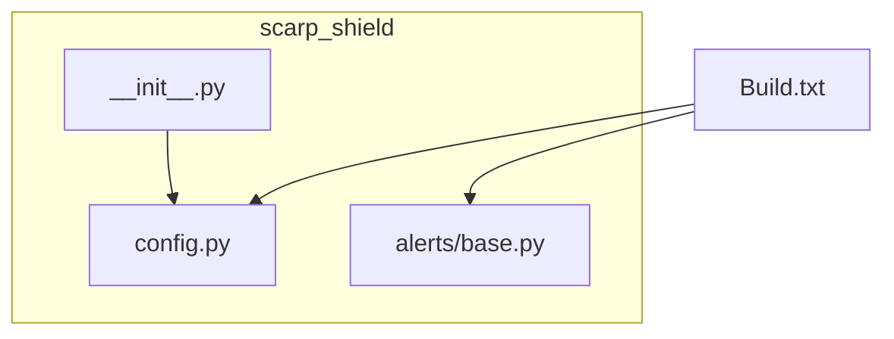
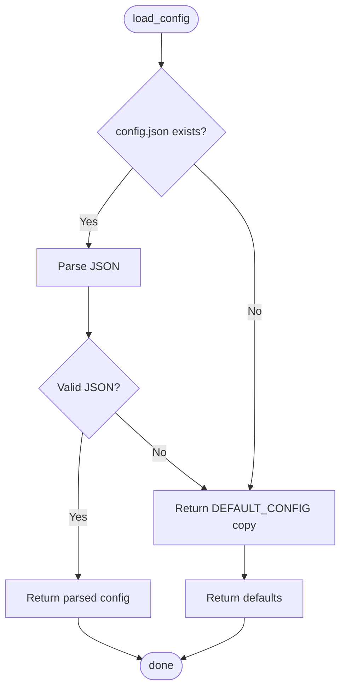
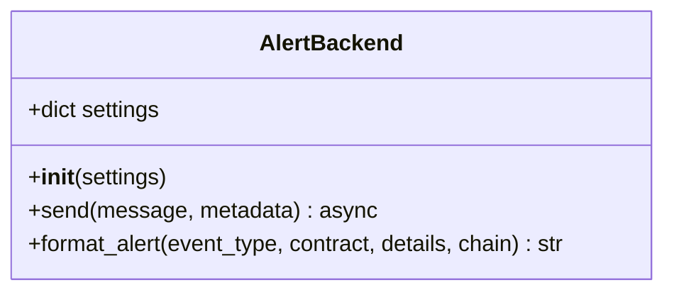
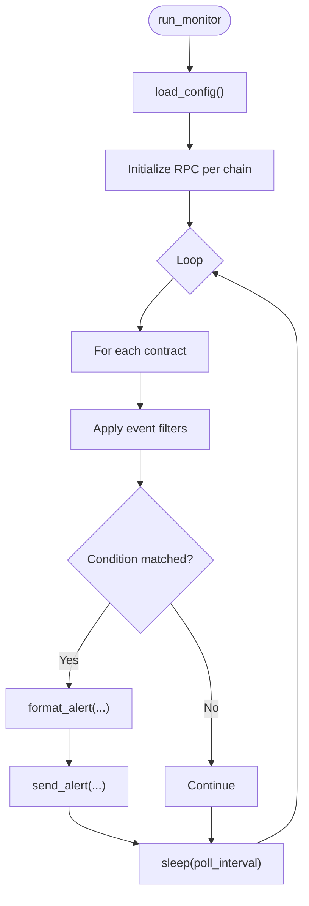
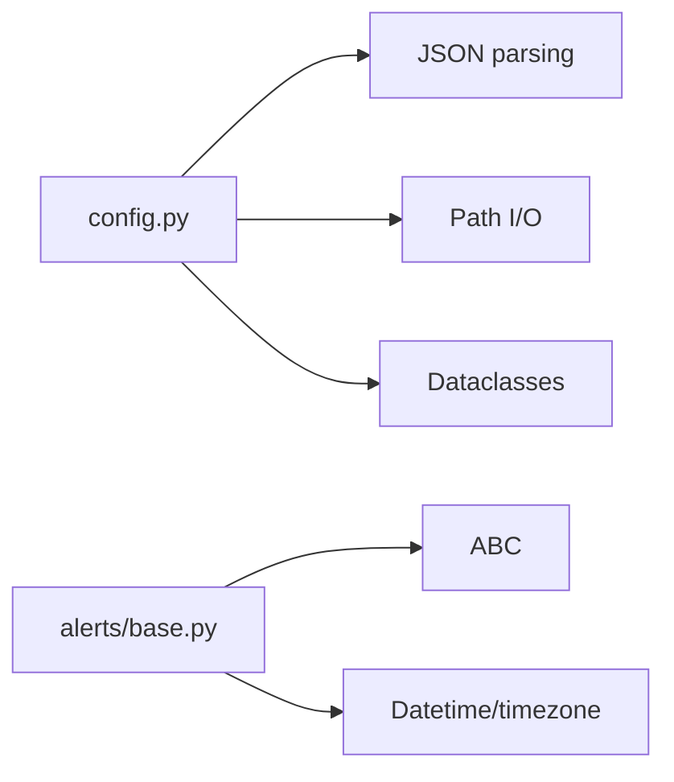

# Monitoring Engine

<cite>
**Referenced Files in This Document**
- [config.py](file://scarp_shield/config.py)
- [base.py](file://scarp_shield/alerts/base.py)
- [Build.txt](file://Build.txt)
</cite>

## Table of Contents
1. [Introduction](#introduction)
2. [Project Structure](#project-structure)
3. [Core Components](#core-components)
4. [Architecture Overview](#architecture-overview)
5. [Detailed Component Analysis](#detailed-component-analysis)
6. [Dependency Analysis](#dependency-analysis)
7. [Performance Considerations](#performance-considerations)
8. [Troubleshooting Guide](#troubleshooting-guide)
9. [Conclusion](#conclusion)
10. [Appendices](#appendices)

## Introduction
This document describes the monitoring engine for ScarpShield, focusing on the core event detection system, Web3 integration patterns, Ethereum RPC provider configuration, and event filtering implementation. It explains the monitoring loop architecture, polling intervals, and contract iteration logic. Guidance is provided for implementing custom event filters for specific transaction types (such as large transfers and admin actions), integrating with the alert system, error handling strategies, and performance considerations. Examples are included for extending monitoring capabilities and adding support for different blockchain networks.

## Project Structure
The repository contains a minimal but structured layout supporting a CLI-driven monitoring tool:
- scarp_shield/config.py: Central configuration loader and helpers for contracts, RPC endpoints, filters, and alert channels.
- scarp_shield/alerts/base.py: Abstract alert backend interface and standardized alert formatting.
- Build.txt: Build plan and implementation roadmap that outlines the intended CLI, monitor loop, and alert integration.

**Diagram sources**
- [config.py:1-148](file://scarp_shield/config.py#L1-L148)
- [base.py:1-36](file://scarp_shield/alerts/base.py#L1-L36)
- [Build.txt:1-146](file://Build.txt#L1-L146)

**Section sources**
- [config.py:1-148](file://scarp_shield/config.py#L1-L148)
- [base.py:1-36](file://scarp_shield/alerts/base.py#L1-L36)
- [Build.txt:1-146](file://Build.txt#L1-L146)

## Core Components
- Configuration module: Loads and persists configuration, exposes helpers for RPC selection, contract management, and alert channel toggles.
- Alert backend abstraction: Defines a common interface for alert backends and provides a standard message formatter.
- Build plan: Outlines the CLI entry points, monitor loop skeleton, and alert integration points.

Key responsibilities:
- Configuration: Manage contracts to monitor, RPC endpoints per chain, polling interval, filters, and alert channels.
- Alerts: Provide a uniform alert message format and a pluggable backend interface.
- Build plan: Define the runtime flow, CLI commands, and extension points for event filtering and alert delivery.

**Section sources**
- [config.py:30-85](file://scarp_shield/config.py#L30-L85)
- [config.py:88-147](file://scarp_shield/config.py#L88-L147)
- [base.py:8-36](file://scarp_shield/alerts/base.py#L8-L36)
- [Build.txt:45-108](file://Build.txt#L45-L108)

## Architecture Overview
The monitoring engine follows a simple loop architecture:
- Load configuration and initialize RPC providers per chain.
- Iterate over monitored contracts and apply event filters.
- Emit formatted alerts when conditions match configured filters.
- Sleep for the configured polling interval before the next cycle.

```mermaid
sequenceDiagram
participant CLI as "CLI"
participant Monitor as "Monitor Loop"
participant Config as "Config Loader"
participant RPC as "RPC Provider"
participant Filter as "Event Filters"
participant Alert as "Alert Backend"
CLI->>Monitor : start command
Monitor->>Config : load_config()
Config-->>Monitor : config
Monitor->>RPC : initialize per-chain provider
loop Polling Interval
Monitor->>Filter : iterate contracts and apply filters
alt Match Found
Filter->>Alert : format_alert() and send()
Alert-->>Monitor : delivery confirmation
else No Match
Monitor->>Monitor : continue
end
Monitor->>Monitor : sleep(poll_interval)
end
```

**Diagram sources**
- [Build.txt:63-84](file://Build.txt#L63-L84)
- [config.py:88-114](file://scarp_shield/config.py#L88-L114)
- [base.py:19-35](file://scarp_shield/alerts/base.py#L19-L35)

## Detailed Component Analysis

### Configuration Module
The configuration module centralizes:
- Default configuration with contracts list, RPC endpoints for multiple chains, poll interval, alert channels, and filters.
- Helpers to load/save configuration, select RPC endpoints by chain, manage contracts, and toggle alert channels.

Implementation highlights:
- Data structures define contract entries with address, label, chain, and event lists.
- RPC selection falls back to a default endpoint if a chain-specific endpoint is not found.
- Contract management avoids duplicates and sets sensible defaults for event lists.
- Alert channel toggling supports enabling/disabling channels and updating settings.

**Diagram sources**
- [config.py:88-96](file://scarp_shield/config.py#L88-L96)

**Section sources**
- [config.py:30-85](file://scarp_shield/config.py#L30-L85)
- [config.py:88-147](file://scarp_shield/config.py#L88-L147)

### Alert Backend Abstraction
The alert backend defines:
- An abstract base class with an asynchronous send method and a shared alert formatter.
- Standardized alert formatting with timestamp, chain, contract, event type, and details.

**Diagram sources**
- [base.py:8-36](file://scarp_shield/alerts/base.py#L8-L36)

**Section sources**
- [base.py:8-36](file://scarp_shield/alerts/base.py#L8-L36)

### Monitoring Loop and Event Filtering
The monitoring loop skeleton and event filtering are outlined in the build plan:
- CLI start command triggers the monitor loop.
- The loop initializes a Web3 provider per chain and iterates over contracts.
- The loop sleeps for the configured poll interval between cycles.
- Event filtering placeholders indicate where to add logic for large transfers, admin actions, approvals, and other custom filters.

**Diagram sources**
- [Build.txt:63-84](file://Build.txt#L63-L84)
- [config.py:110-114](file://scarp_shield/config.py#L110-L114)
- [base.py:19-35](file://scarp_shield/alerts/base.py#L19-L35)

**Section sources**
- [Build.txt:63-84](file://Build.txt#L63-L84)
- [config.py:110-114](file://scarp_shield/config.py#L110-L114)
- [base.py:19-35](file://scarp_shield/alerts/base.py#L19-L35)

### Extending Monitoring Capabilities
Guidance for extending the monitoring engine:
- Add new event filters: Implement filter functions for large transfers, admin actions, approvals, and other custom criteria. Integrate these into the monitoring loop where indicated by the placeholder comments.
- Support additional chains: Extend the RPC endpoints dictionary with new chains and update contract entries to specify chain identifiers. The RPC selection helper will automatically choose the appropriate endpoint.
- Add alert backends: Implement new alert backends by subclassing the abstract base class and registering them via the configuration module.

Examples of extensions:
- Large transfers: Compare value thresholds and emit alerts when exceeded.
- Admin actions: Watch for OwnershipTransferred and other governance-related events.
- Approvals: Track Approval events for delegated spending limits.

**Section sources**
- [config.py:35-42](file://scarp_shield/config.py#L35-L42)
- [config.py:116-128](file://scarp_shield/config.py#L116-L128)
- [base.py:8-17](file://scarp_shield/alerts/base.py#L8-L17)

## Dependency Analysis
The configuration module depends on:
- JSON parsing and file I/O for loading and saving configuration.
- Dataclass structures for typed configuration objects.
- Helpers for RPC selection and contract management.

The alert backend abstraction depends on:
- An abstract base class to enforce a consistent interface across alert backends.
- A standardized alert formatting function for consistent messaging.

**Diagram sources**
- [config.py:4-6](file://scarp_shield/config.py#L4-L6)
- [base.py:4-5](file://scarp_shield/alerts/base.py#L4-L5)

**Section sources**
- [config.py:4-6](file://scarp_shield/config.py#L4-L6)
- [base.py:4-5](file://scarp_shield/alerts/base.py#L4-L5)

## Performance Considerations
- Polling interval tuning: Adjust the poll interval to balance responsiveness and RPC load. Lower intervals increase alert latency but raise RPC usage.
- Batch queries: Group contract checks and RPC calls to minimize overhead.
- Chain-specific endpoints: Use optimized RPC endpoints per chain to reduce latency and improve reliability.
- Backoff and retry: Implement exponential backoff and retries for transient RPC failures.
- Alert throttling: Prevent alert storms by rate-limiting repeated alerts for the same condition.

[No sources needed since this section provides general guidance]

## Troubleshooting Guide
Common issues and remedies:
- Malformed configuration: The configuration loader falls back to defaults if the JSON is invalid. Verify config.json syntax and keys.
- Missing RPC endpoints: If a chain is not configured, the RPC selection helper falls back to a default endpoint. Ensure endpoints are defined for all target chains.
- Contract duplicates: Contract management prevents duplicate entries by address. Verify addresses and labels.
- Alert delivery failures: Implement error handling around alert sending and consider fallback channels.

**Section sources**
- [config.py:88-96](file://scarp_shield/config.py#L88-L96)
- [config.py:110-114](file://scarp_shield/config.py#L110-L114)
- [config.py:116-128](file://scarp_shield/config.py#L116-L128)

## Conclusion
ScarpShield’s monitoring engine provides a lightweight, extensible foundation for detecting and alerting on critical contract events. By leveraging the configuration module for RPC endpoints and filters, the alert backend abstraction for delivery, and the monitoring loop skeleton for periodic scanning, teams can tailor monitoring to specific needs. Extending support to new chains and alert channels, as well as adding custom event filters, is straightforward and maintainable.

[No sources needed since this section summarizes without analyzing specific files]

## Appendices
- Example configuration keys: contracts, rpc_endpoints, poll_interval_seconds, alerts, filters.
- Alert channels: console, email, discord, slack, telegram.
- Filters: min_transfer_value_eth, watch_admin_events, watch_large_transfers, watch_approvals.

**Section sources**
- [config.py:30-85](file://scarp_shield/config.py#L30-L85)