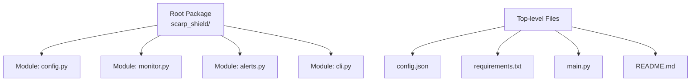
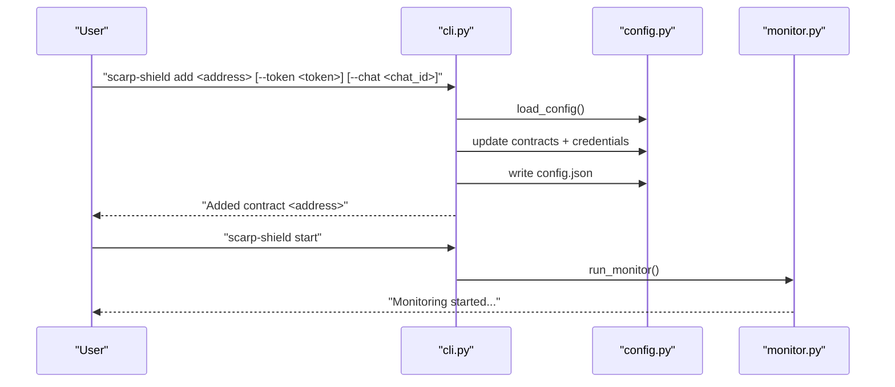
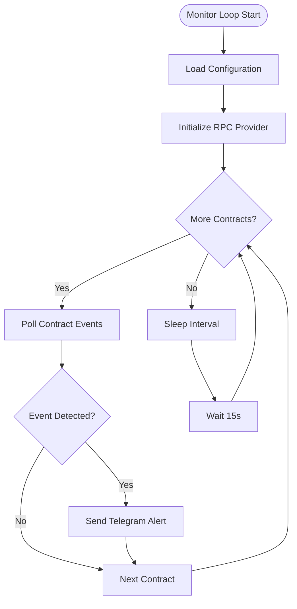
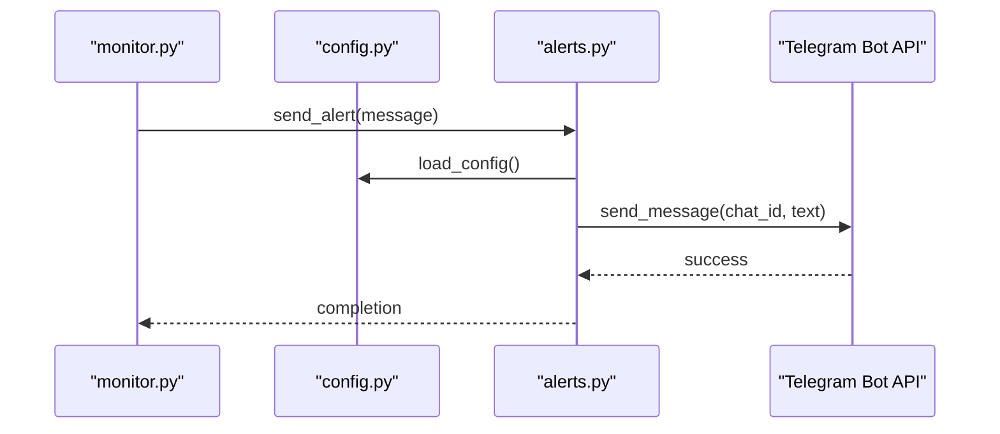
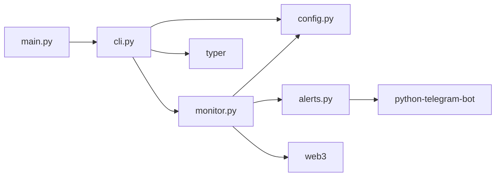

# Project Overview

<cite>
**Referenced Files in This Document**
- [Build.txt](file://Build.txt)
</cite>

## Table of Contents
1. [Introduction](#introduction)
2. [Project Structure](#project-structure)
3. [Core Components](#core-components)
4. [Architecture Overview](#architecture-overview)
5. [Detailed Component Analysis](#detailed-component-analysis)
6. [Dependency Analysis](#dependency-analysis)
7. [Performance Considerations](#performance-considerations)
8. [Troubleshooting Guide](#troubleshooting-guide)
9. [Conclusion](#conclusion)

## Introduction
ScarpShield is an official self-hosted monitoring tool for the CounterScarp.io ecosystem. It is a lightweight CLI application designed to monitor specific Ethereum smart contracts and deliver real-time Telegram alerts. The project emphasizes privacy, portability, and local operation: users add targeted contracts, monitor only those contracts, and receive instant notifications via Telegram without relying on external cloud services.

Key characteristics:
- Self-hosted and runs locally on your machine
- Monitors only contracts explicitly added by the user
- Sends real-time Telegram alerts for significant events
- Lightweight and minimal resource footprint
- Built as a Python CLI application with a clear extension path for advanced monitoring

Target audience:
- Smart contract developers who want to track critical contract events
- DeFi operators managing production contracts and liquidity pools
- Security researchers monitoring for suspicious activity or exploit attempts

Benefits of self-hosted monitoring versus cloud-based solutions:
- Full control over data and alert delivery
- No third-party exposure of sensitive operational data
- Reduced latency by running close to your infrastructure
- Lower ongoing costs and no recurring subscriptions
- Ability to tailor monitoring logic precisely to your needs

Relationship to the CounterScarp.io ecosystem:
- ScarpShield is branded as the official monitoring companion for CounterScarp.io
- It integrates with the broader CounterScarp toolchain and website
- Designed to complement CounterScarp’s analytics and threat intelligence workflows

## Project Structure
The repository layout follows a simple, modular Python package structure intended for rapid development and iteration. The build plan outlines the recommended folder hierarchy and core files.

Recommended structure:
- Root package: scarp_shield/
  - Module files: __init__.py, config.py, monitor.py, alerts.py, cli.py
- Top-level configuration and entry points:
  - config.json (runtime configuration)
  - requirements.txt (dependencies)
  - main.py (application entry)
  - README.md (project documentation)

This structure cleanly separates concerns:
- Configuration management
- Event monitoring loop
- Alert delivery
- Command-line interface
- Application entrypoint



**Diagram sources**
- [Build.txt:9-19](file://Build.txt#L9-L19)

**Section sources**
- [Build.txt:9-19](file://Build.txt#L9-L19)

## Core Components
ScarpShield centers around four primary building blocks that work together to deliver contract monitoring and alerting:

- Configuration module (config.py): Loads and persists runtime settings, including the list of monitored contracts and Telegram credentials.
- Monitor module (monitor.py): Implements the continuous monitoring loop, iterating over configured contracts and invoking event filtering logic.
- Alerts module (alerts.py): Handles asynchronous Telegram messaging using stored credentials.
- CLI module (cli.py): Provides Typer-based command-line commands to add contracts and start monitoring.
- Application entry (main.py): Wires the CLI into the application lifecycle.

How they collaborate:
- The CLI initializes configuration and starts the monitor loop.
- The monitor loop queries each contract at regular intervals and triggers alert logic for detected events.
- Alerts are sent asynchronously to the configured Telegram chat.

**Section sources**
- [Build.txt:34-44](file://Build.txt#L34-L44)
- [Build.txt:45-68](file://Build.txt#L45-L68)
- [Build.txt:69-84](file://Build.txt#L69-L84)
- [Build.txt:85-92](file://Build.txt#L85-L92)
- [Build.txt:93-96](file://Build.txt#L93-L96)

## Architecture Overview
The system architecture is intentionally simple and extensible. It consists of a CLI-driven startup, a persistent configuration store, a polling monitor loop, and an alert subsystem.

```mermaid
graph TB
subgraph "CLI Layer"
CLI["cli.py<br/>Typer commands"]
end
subgraph "Core Logic"
CFG["config.py<br/>load_config()"]
MON["monitor.py<br/>run_monitor()"]
ALR["alerts.py<br/>send_alert()"]
end
subgraph "External Services"
TGB["Telegram Bot API"]
RPC["Ethereum RPC Provider"]
end
subgraph "Persistence"
CJ["config.json"]
end
CLI --> CFG
CLI --> MON
MON --> CFG
MON --> RPC
MON --> ALR
ALR --> TGB
CFG <- --> CJ
```

**Diagram sources**
- [Build.txt:45-68](file://Build.txt#L45-L68)
- [Build.txt:69-84](file://Build.txt#L69-L84)
- [Build.txt:85-92](file://Build.txt#L85-L92)
- [Build.txt:34-44](file://Build.txt#L34-L44)

## Detailed Component Analysis

### CLI Workflow
The CLI exposes two primary commands:
- add: Appends a contract address to the configuration and optionally updates Telegram credentials
- start: Launches the monitoring loop



**Diagram sources**
- [Build.txt:45-68](file://Build.txt#L45-L68)
- [Build.txt:34-44](file://Build.txt#L34-L44)
- [Build.txt:69-84](file://Build.txt#L69-L84)

**Section sources**
- [Build.txt:45-68](file://Build.txt#L45-L68)

### Monitoring Loop
The monitor loop periodically checks each configured contract and is designed to integrate event filters. The current skeleton demonstrates the polling cadence and placeholder for event detection.



**Diagram sources**
- [Build.txt:69-84](file://Build.txt#L69-L84)

**Section sources**
- [Build.txt:69-84](file://Build.txt#L69-L84)

### Alert Delivery
Alerts are sent asynchronously using the Telegram Bot API with credentials loaded from configuration. The alert function constructs a Bot client and dispatches messages to the configured chat.



**Diagram sources**
- [Build.txt:85-92](file://Build.txt#L85-L92)
- [Build.txt:34-44](file://Build.txt#L34-L44)

**Section sources**
- [Build.txt:85-92](file://Build.txt#L85-L92)

### Conceptual Overview for Beginners
- Blockchain monitoring basics: Monitoring a smart contract means watching for on-chain events (like transfers, approvals, ownership changes) and reacting when something significant happens.
- Why self-hosted matters: Running the monitor on your own machine keeps your data private and lets you react quickly without depending on third-party services.
- How ScarpShield fits in DeFi: DeFi protocols rely on transparent, trustless systems. Monitoring helps operators detect exploits, unusual movements, or governance actions in real time.

[No sources needed since this section provides conceptual guidance]

## Dependency Analysis
The project relies on a small set of focused dependencies that enable CLI interaction, configuration loading, Ethereum connectivity, and Telegram messaging.

- Typer: Declarative CLI framework for command definitions
- web3: Ethereum JSON-RPC client for contract/event queries
- python-telegram-bot: Telegram Bot API client for alert delivery
- python-dotenv: Optional environment variable support for secrets



**Diagram sources**
- [Build.txt:93-96](file://Build.txt#L93-L96)
- [Build.txt:20-25](file://Build.txt#L20-L25)

**Section sources**
- [Build.txt:20-25](file://Build.txt#L20-L25)

## Performance Considerations
- Polling interval: The monitor currently sleeps for a fixed interval between checks. Adjusting this balance affects responsiveness vs. RPC load.
- Contract count scaling: As more contracts are added, total polling time increases linearly. Consider batching or parallelization if monitoring many contracts.
- Network selection: Using a reliable RPC provider reduces timeouts and re-tries during polling.
- Alert volume: Excessive alerts can overwhelm operators. Introduce event filtering and deduplication to keep alerts actionable.

[No sources needed since this section provides general guidance]

## Troubleshooting Guide
Common issues and remedies:
- Missing Telegram credentials: Ensure telegram_token and telegram_chat_id are set in configuration before starting monitoring.
- RPC connectivity: Verify the RPC endpoint is reachable and supports the desired chain.
- Contract address format: Use proper checksummed Ethereum addresses to avoid lookup failures.
- Permission errors: Confirm the process has read/write access to config.json and executes with appropriate permissions.

Operational tips:
- Start with a single contract and a testnet deployment to validate the pipeline.
- Use verbose logging during initial setup to confirm successful polling and alert delivery.
- Keep configuration updated incrementally and back it up regularly.

**Section sources**
- [Build.txt:34-44](file://Build.txt#L34-L44)
- [Build.txt:69-84](file://Build.txt#L69-L84)
- [Build.txt:85-92](file://Build.txt#L85-L92)

## Conclusion
ScarpShield delivers a pragmatic, self-hosted solution for monitoring specific Ethereum smart contracts with real-time Telegram alerts. Its clean architecture, minimal dependencies, and clear extension points make it suitable for developers, DeFi operators, and security researchers who value privacy, control, and flexibility. As part of the CounterScarp.io ecosystem, it complements broader DeFi monitoring and threat intelligence workflows, enabling teams to maintain situational awareness without exposing sensitive data to third parties.

[No sources needed since this section summarizes without analyzing specific files]