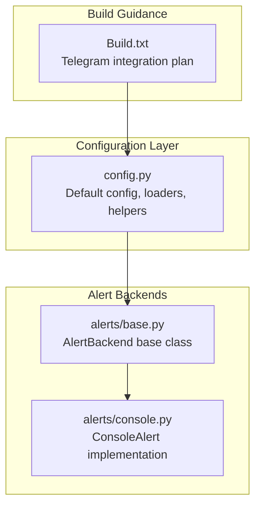
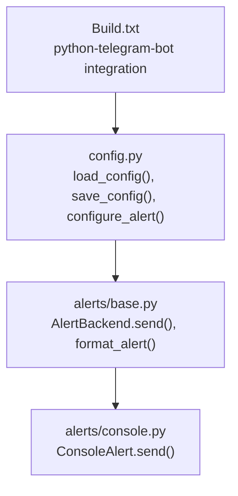
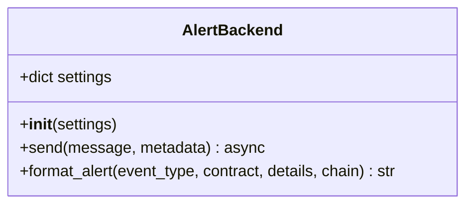
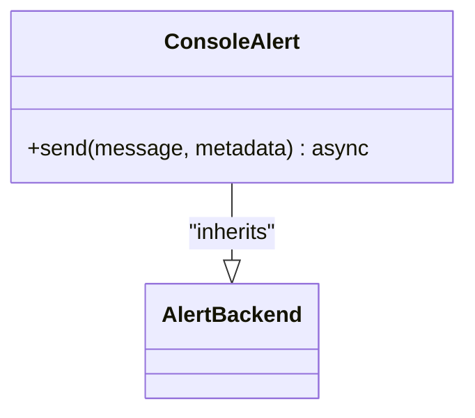
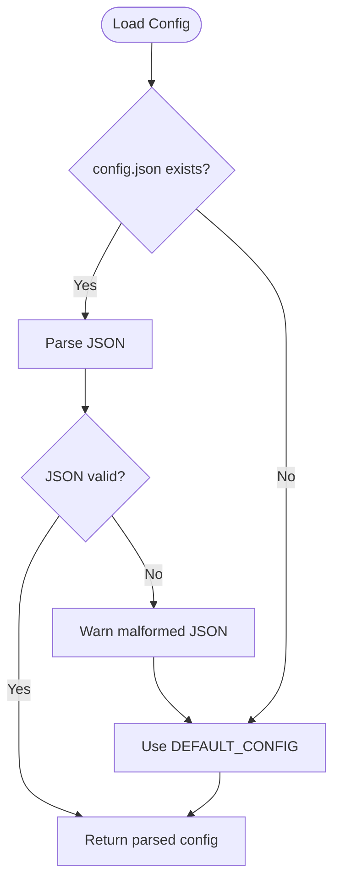
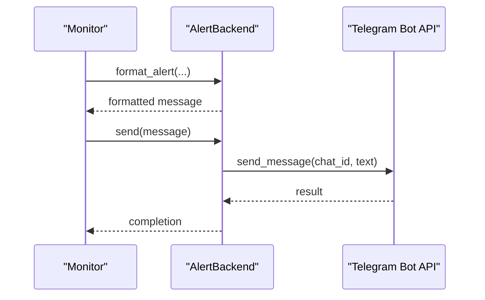
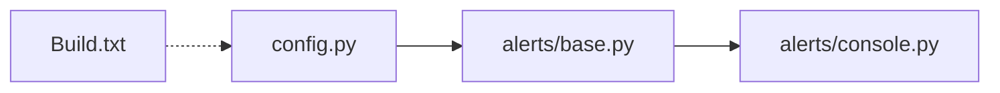

# Telegram Alert System

<cite>
**Referenced Files in This Document**
- [config.py](file://scarp_shield/config.py)
- [base.py](file://scarp_shield/alerts/base.py)
- [console.py](file://scarp_shield/alerts/console.py)
- [Build.txt](file://Build.txt)
</cite>

## Table of Contents
1. [Introduction](#introduction)
2. [Project Structure](#project-structure)
3. [Core Components](#core-components)
4. [Architecture Overview](#architecture-overview)
5. [Detailed Component Analysis](#detailed-component-analysis)
6. [Dependency Analysis](#dependency-analysis)
7. [Performance Considerations](#performance-considerations)
8. [Troubleshooting Guide](#troubleshooting-guide)
9. [Conclusion](#conclusion)

## Introduction
This document explains ScarpShield's Telegram alert system for delivering notifications about smart contract events. It covers the asynchronous alert sending mechanism, Telegram Bot API integration, message formatting patterns, configuration and token setup, chat ID management, customization of alert messages, failure handling, retry strategies, and operational best practices. The system is designed as a self-hosted CLI tool that runs locally and sends Telegram alerts when configured.

## Project Structure
The repository contains a minimal but complete Telegram alert implementation alongside a flexible configuration system and a base alert backend framework. The key elements are:
- Configuration management for alert channels and runtime settings
- A base alert backend interface for pluggable alert providers
- A console alert backend for local testing
- A build plan indicating the intended Telegram integration via python-telegram-bot

**Diagram sources**
- [config.py:14-147](file://scarp_shield/config.py#L14-L147)
- [base.py:8-36](file://scarp_shield/alerts/base.py#L8-L36)
- [console.py:7-12](file://scarp_shield/alerts/console.py#L7-L12)
- [Build.txt:20-26](file://Build.txt#L20-L26)

**Section sources**
- [config.py:14-147](file://scarp_shield/config.py#L14-L147)
- [base.py:8-36](file://scarp_shield/alerts/base.py#L8-L36)
- [console.py:7-12](file://scarp_shield/alerts/console.py#L7-L12)
- [Build.txt:20-26](file://Build.txt#L20-L26)

## Core Components
- Alert configuration model: Defines the structure for enabling/disabling alert channels and storing provider-specific settings, including Telegram bot token and chat ID.
- Base alert backend: Provides a common interface for alert providers, including a standardized message formatter.
- Console alert backend: Implements the base interface for printing alerts to standard output.
- Configuration loader/saver: Reads and writes the JSON configuration file, with defaults applied when missing or malformed.

Key responsibilities:
- Telegram configuration storage and retrieval
- Standardized alert message formatting
- Async alert sending abstraction
- Enabling/disabling alert channels and updating settings

**Section sources**
- [config.py:14-147](file://scarp_shield/config.py#L14-L147)
- [base.py:8-36](file://scarp_shield/alerts/base.py#L8-L36)
- [console.py:7-12](file://scarp_shield/alerts/console.py#L7-L12)

## Architecture Overview
The alert system follows a layered design:
- Configuration layer manages alert channel settings and runtime parameters
- Alert backend layer defines the contract for sending alerts asynchronously
- Provider implementations plug into the backend layer (console currently present; Telegram to be implemented)
- The build plan indicates the Telegram provider will use python-telegram-bot

**Diagram sources**
- [config.py:88-147](file://scarp_shield/config.py#L88-L147)
- [base.py:8-36](file://scarp_shield/alerts/base.py#L8-L36)
- [console.py:7-12](file://scarp_shield/alerts/console.py#L7-L12)
- [Build.txt:20-26](file://Build.txt#L20-L26)

## Detailed Component Analysis

### Alert Backend Framework
The base alert backend defines:
- An async send method to deliver messages
- A standardized formatter that includes timestamp, chain, contract, event type, and details

**Diagram sources**
- [base.py:8-36](file://scarp_shield/alerts/base.py#L8-L36)

**Section sources**
- [base.py:8-36](file://scarp_shield/alerts/base.py#L8-L36)

### Console Alert Implementation
The console backend implements the base interface to print formatted alerts to standard output. This is useful for local development and testing.

**Diagram sources**
- [console.py:7-12](file://scarp_shield/alerts/console.py#L7-L12)
- [base.py:8-36](file://scarp_shield/alerts/base.py#L8-L36)

**Section sources**
- [console.py:7-12](file://scarp_shield/alerts/console.py#L7-L12)
- [base.py:8-36](file://scarp_shield/alerts/base.py#L8-L36)

### Configuration Management
Configuration includes:
- Default configuration with alert channels (console, email, discord, slack, telegram)
- Helpers to load/save configuration
- Helper to enable/disable and update alert channel settings
- Helper to resolve RPC endpoints per chain

**Diagram sources**
- [config.py:88-101](file://scarp_shield/config.py#L88-L101)

**Section sources**
- [config.py:30-85](file://scarp_shield/config.py#L30-L85)
- [config.py:88-101](file://scarp_shield/config.py#L88-L101)
- [config.py:104-147](file://scarp_shield/config.py#L104-L147)

### Telegram Integration (Planned)
According to the build plan, Telegram integration will use python-telegram-bot. The implementation will:
- Load bot token and chat ID from configuration
- Send messages asynchronously via the Bot API
- Follow the AlertBackend interface for consistency

**Diagram sources**
- [base.py:14-36](file://scarp_shield/alerts/base.py#L14-L36)
- [Build.txt:87-92](file://Build.txt#L87-L92)

**Section sources**
- [Build.txt:20-26](file://Build.txt#L20-L26)
- [Build.txt:87-92](file://Build.txt#L87-L92)
- [config.py:71-77](file://scarp_shield/config.py#L71-L77)

## Dependency Analysis
- AlertBackend is the central abstraction used by all alert providers
- ConsoleAlert depends on AlertBackend
- Configuration is consumed by alert providers and the monitor loop
- The build plan indicates python-telegram-bot as the external dependency for Telegram

**Diagram sources**
- [config.py:88-147](file://scarp_shield/config.py#L88-L147)
- [base.py:8-36](file://scarp_shield/alerts/base.py#L8-L36)
- [console.py:7-12](file://scarp_shield/alerts/console.py#L7-L12)
- [Build.txt:20-26](file://Build.txt#L20-L26)

**Section sources**
- [config.py:88-147](file://scarp_shield/config.py#L88-L147)
- [base.py:8-36](file://scarp_shield/alerts/base.py#L8-L36)
- [console.py:7-12](file://scarp_shield/alerts/console.py#L7-L12)
- [Build.txt:20-26](file://Build.txt#L20-L26)

## Performance Considerations
- Asynchronous alert sending avoids blocking the monitoring loop
- Standardized formatting reduces overhead and ensures consistent alert content
- Configuration loading occurs at startup or on demand; cache where appropriate in production deployments
- Limit message sizes and avoid excessive formatting work inside tight loops

## Troubleshooting Guide
Common issues and resolutions:
- Malformed configuration file
  - Symptom: Warning about malformed JSON followed by defaults
  - Action: Validate config.json syntax and re-save
  - Section sources
    - [config.py:88-101](file://scarp_shield/config.py#L88-L101)

- Telegram token or chat ID missing
  - Symptom: Alerts not sent or API errors
  - Action: Enable telegram channel and set bot_token and chat_id in configuration
  - Section sources
    - [config.py:71-77](file://scarp_shield/config.py#L71-L77)

- Rate limits or API errors
  - Symptom: Temporary failures from Telegram Bot API
  - Action: Implement retry with exponential backoff and circuit breaker; log failures
  - Section sources
    - [base.py:14-36](file://scarp_shield/alerts/base.py#L14-L36)
    - [Build.txt:87-92](file://Build.txt#L87-L92)

- Message formatting inconsistencies
  - Symptom: Varying alert content
  - Action: Use the base formatter to ensure consistent fields
  - Section sources
    - [base.py:19-36](file://scarp_shield/alerts/base.py#L19-L36)

- Monitoring loop not triggering alerts
  - Symptom: No alerts despite events
  - Action: Verify monitor logic and ensure send_alert is called after detecting events
  - Section sources
    - [Build.txt:76-84](file://Build.txt#L76-L84)

## Conclusion
ScarpShield provides a clean, extensible foundation for alert delivery with a strong emphasis on asynchronous operation and standardized formatting. The Telegram alert system is planned to integrate via python-telegram-bot, following the established AlertBackend interface. By leveraging the configuration helpers, base formatter, and console backend for testing, developers can implement robust Telegram alerts with reliable error handling and retry strategies.